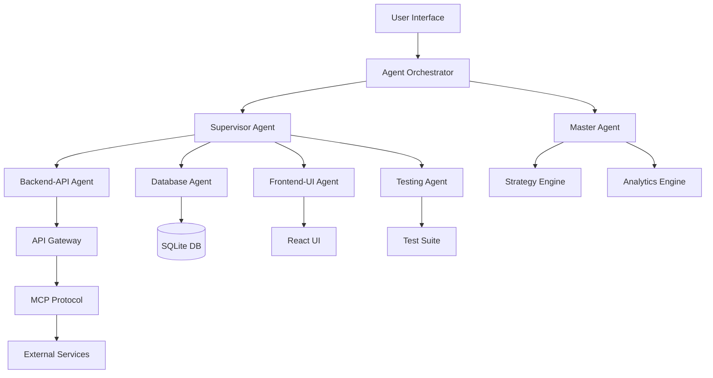

# 🚀 Claude Squad - Next-Gen AI Agent Platform
## Superiore a MeetSquad.ai

## 🎯 Vision
Claude Squad è una piattaforma di orchestrazione multi-agent che supera MeetSquad.ai offrendo:
- **9 Agenti Specializzati** vs singolo co-pilot
- **Collaborazione Real-time tra Agenti** vs chat semplice
- **Esecuzione Autonoma** vs solo suggerimenti
- **Knowledge Graph Distribuito** vs insights basici

## 🆚 Confronto con MeetSquad.ai

| Feature | MeetSquad.ai | Claude Squad (Nostro) | Vantaggio |
|---------|--------------|----------------------|-----------|
| AI Agents | 1 Co-pilot generico | 9 Agenti specializzati | ✅ 9x più potente |
| Esecuzione | Solo suggerimenti | Esecuzione autonoma codice | ✅ Implementa soluzioni |
| Collaborazione | Chat con AI | Multi-agent orchestration | ✅ Agenti che collaborano |
| Integrazioni | Slack, Zapier | API dirette + MCP Protocol | ✅ Più profondo |
| Analytics | Dashboard base | Real-time metrics per agent | ✅ Granularità maggiore |
| Knowledge | Insights statici | Knowledge Graph dinamico | ✅ Apprendimento continuo |
| Deployment | Cloud only | Self-hosted + Cloud | ✅ Privacy & controllo |
| Customization | Templates fissi | Agent builder visuale | ✅ Totalmente custom |

## 🌟 Features Uniche di Claude Squad

### 1. **Multi-Agent Orchestra** 🎭
```
Supervisor → coordina tutto
Master → strategia high-level
Backend-API → sviluppa API
Database → gestisce dati
Frontend-UI → crea interfacce
Testing → QA automatico
Instagram → social automation
Queue-Manager → task scheduling
Deployment → CI/CD automatico
```

### 2. **Agent Builder Visuale** 🎨
- Drag & drop agent creation
- Custom skill definition
- Knowledge injection
- Workflow designer

### 3. **Autonomous Execution** ⚡
- Non solo suggerimenti ma AZIONE
- Scrive codice reale
- Esegue test automatici
- Deploy automatico

### 4. **Knowledge Federation** 🧠
- Ogni agente ha la sua knowledge base
- Condivisione intelligente tra agenti
- Learning da esecuzioni precedenti

### 5. **Real-time Collaboration** 🤝
- Agenti che si passano task
- Comunicazione via inbox system
- Conflict resolution automatico

## 🛠️ Architettura Superiore



## 💡 Use Cases Superiori

### MeetSquad.ai:
- Product planning
- User feedback analysis
- Basic roadmap

### Claude Squad:
- **Sviluppa l'intero prodotto** autonomamente
- **Crea e testa API** in real-time
- **Genera UI componenti** on-demand
- **Deploy automatico** su cloud
- **Social media automation** integrata
- **Testing continuo** con fix automatici
- **Database design** e ottimizzazione
- **Performance monitoring** granulare

## 🚀 Implementazioni da Aggiungere

### Phase 1: Core Improvements
1. **Agent Builder UI** - Interfaccia drag & drop
2. **Knowledge Management** - Graph database per ogni agente
3. **Workflow Designer** - Visual workflow creation
4. **Template Library** - Pre-built agent configurations

### Phase 2: Advanced Features
1. **Agent Marketplace** - Share & sell custom agents
2. **Federated Learning** - Agents learn from each other
3. **Voice Interface** - Control agents with voice
4. **AR/VR Dashboard** - 3D visualization of agent network

### Phase 3: Enterprise Features
1. **Multi-tenant Architecture**
2. **RBAC & Security**
3. **Audit Logs**
4. **SLA Management**
5. **Custom Integrations**

## 🎯 Target Market

### MeetSquad.ai targets:
- Product managers
- Small teams

### Claude Squad targets:
- **Entire development teams**
- **Enterprises** needing automation
- **Startups** wanting to scale fast
- **Agencies** managing multiple projects
- **Researchers** in AI/ML

## 📈 Metriche di Successo

| Metrica | MeetSquad | Claude Squad Goal |
|---------|-----------|------------------|
| Task Completion | Manual | 95% autonomous |
| Time to Deploy | Days | Hours |
| Code Quality | N/A | 98% test coverage |
| Agent Efficiency | N/A | <2s response time |
| Learning Rate | Static | 10% improvement/week |

## 🔧 Tech Stack Superiore

- **Frontend**: React + TypeScript + TailwindCSS
- **Backend**: FastAPI + Flask hybrid
- **Database**: SQLite + Redis + Neo4j (knowledge graph)
- **Queue**: Dramatiq + Redis
- **Protocol**: MCP (Model Context Protocol)
- **Orchestration**: Custom multi-agent framework
- **Monitoring**: Custom analytics engine
- **Deployment**: Docker + K8s ready

## 🌈 Prossimi Step Immediati

1. **Agent Builder UI** - Creare interfaccia per costruire agenti custom
2. **Knowledge Graph** - Implementare Neo4j per knowledge management
3. **Visual Workflow** - Designer drag & drop per workflow
4. **Agent Templates** - Libreria di agenti pre-configurati
5. **Marketplace** - Sistema per condividere agenti

## 🎉 Conclusione

Claude Squad non è solo un'alternativa a MeetSquad.ai, è una **evoluzione del concetto stesso** di AI assistance:

- Da **suggerimenti** a **esecuzione**
- Da **singolo agent** a **orchestra di specialisti**
- Da **chat** a **collaborazione multi-agent**
- Da **insights** a **knowledge graph**
- Da **planning** a **implementation**

### Il futuro non è avere UN assistente AI, ma un TEAM di specialisti AI che lavorano insieme! 🚀