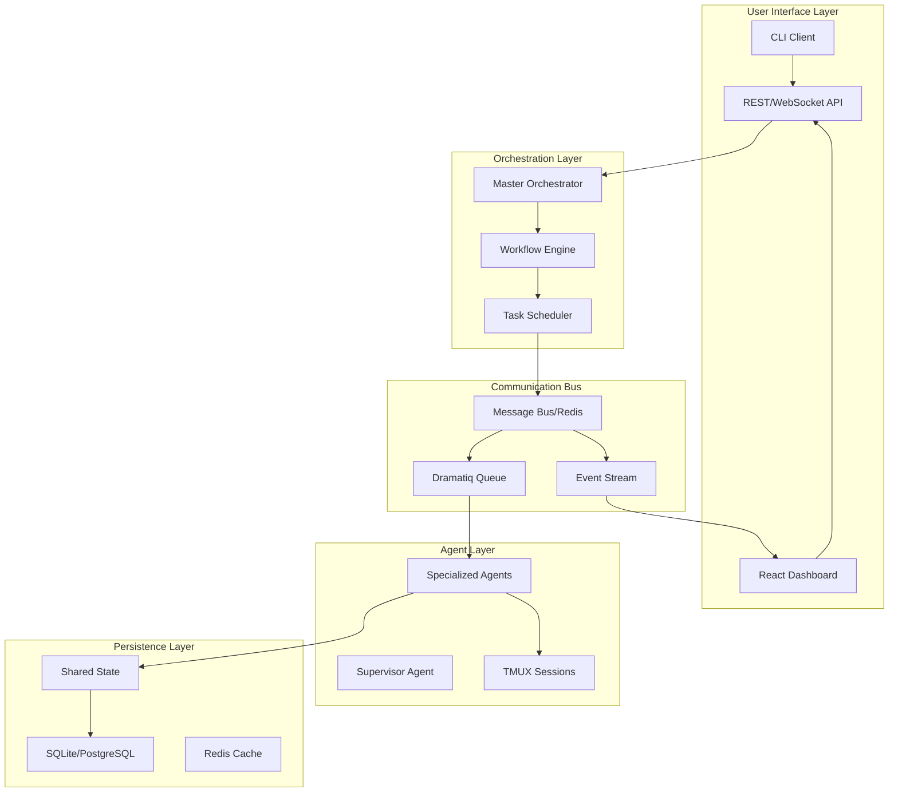

# 🔧 Piano di Integrazione Completa - Claude Multi-Agent System

## 📋 Executive Summary
Il sistema attuale ha tutti i componenti ma manca l'integrazione effettiva. Questo piano definisce come collegare tutto per creare un sistema funzionante end-to-end.

## 🎯 Obiettivi Principali
1. **Unificare la comunicazione** tra tutti i componenti
2. **Implementare casi d'uso reali** funzionanti
3. **Automatizzare i workflow** complessi
4. **Garantire affidabilità** e recovery automatico
5. **Fornire interfacce user-friendly** per l'utilizzo

## 🔍 Analisi Gap Attuali

### Componenti Disconnessi
- **TMUX ↔ Dramatiq**: Agenti TMUX non comunicano con coda Dramatiq
- **React UI ↔ Backend**: Dashboard React non collegata al sistema reale
- **LangChain ↔ CrewAI**: Integrazioni separate non coordinate
- **State ↔ Persistence**: Stato in memoria non sincronizzato con DB
- **Monitoring ↔ Alerts**: Metriche raccolte ma non actionable

### Problemi Critici
```
❌ Nessun workflow end-to-end funzionante
❌ Agenti non ricevono task reali dalla coda
❌ Risultati non aggregati automaticamente
❌ Nessun error recovery automatico
❌ UI non riflette stato reale sistema
```

## 🏗️ Architettura Target



## 🚀 Fasi di Implementazione

### Fase 1: Message Bus Centrale (2-3 giorni)
**Obiettivo**: Unificare tutte le comunicazioni attraverso Redis

```python
# core/message_bus.py
class UnifiedMessageBus:
    """
    Gestisce TUTTE le comunicazioni:
    - Comandi agli agenti
    - Risultati dai task
    - Eventi di sistema
    - Notifiche real-time
    """

    def publish_task(self, agent: str, task: dict)
    def subscribe_results(self, callback)
    def broadcast_event(self, event_type: str, data: dict)
```

**Tasks**:
- [ ] Implementare publisher/subscriber pattern
- [ ] Integrare con Dramatiq esistente
- [ ] Aggiungere event streaming per UI
- [ ] Creare adapter per TMUX commands

### Fase 2: Workflow Engine (3-4 giorni)
**Obiettivo**: Orchestrazione intelligente di task complessi

```python
# core/workflow_engine.py
class WorkflowEngine:
    """
    Gestisce workflow multi-step:
    - Definizione workflow YAML/JSON
    - Dependency resolution
    - Parallel/sequential execution
    - Rollback su errori
    """

    def define_workflow(self, definition: dict)
    def execute(self, workflow_id: str, params: dict)
    def monitor_progress(self, execution_id: str)
```

**Workflow Examples**:
```yaml
# workflows/deploy_app.yaml
name: "Deploy Full Application"
steps:
  - id: test
    agent: testing
    action: "run_tests"

  - id: build
    agent: backend-api
    action: "build_docker"
    depends_on: [test]

  - id: deploy
    agent: deployment
    action: "deploy_k8s"
    depends_on: [build]
```

### Fase 3: Agent Integration Layer (2-3 giorni)
**Obiettivo**: Collegare agenti TMUX con sistema di code

```python
# agents/agent_bridge.py
class AgentBridge:
    """
    Bridge tra TMUX e Dramatiq:
    - Riceve task da coda
    - Traduce in comandi TMUX
    - Cattura output
    - Pubblica risultati
    """

    def process_queue_task(self, message: DramatiqMessage)
    def execute_in_tmux(self, session: str, command: str)
    def capture_and_publish_result(self, output: str)
```

**Implementazione**:
- [ ] Worker Dramatiq per ogni agente
- [ ] Parser output TMUX strutturato
- [ ] Result aggregation service
- [ ] Error detection e retry logic

### Fase 4: State Synchronization (2 giorni)
**Obiettivo**: Stato coerente tra tutti i componenti

```python
# core/state_sync.py
class StateManager:
    """
    Sincronizzazione stato:
    - Write-through cache Redis
    - Persistence SQLite/PostgreSQL
    - Event sourcing per audit
    - Snapshot e recovery
    """

    def update_state(self, key: str, value: Any)
    def get_state(self, key: str) -> Any
    def subscribe_changes(self, pattern: str, callback)
```

### Fase 5: API Gateway Unificato (2 giorni)
**Obiettivo**: Singolo punto di accesso per tutte le operazioni

```python
# api/gateway.py
from fastapi import FastAPI, WebSocket

app = FastAPI()

@app.post("/tasks/submit")
async def submit_task(task: TaskRequest):
    """Submit task to appropriate agent"""

@app.get("/agents/status")
async def get_agents_status():
    """Real-time agent status"""

@app.websocket("/events")
async def event_stream(websocket: WebSocket):
    """Stream system events to UI"""
```

### Fase 6: Casi d'Uso Reali (3-4 giorni)
**Obiettivo**: Implementare funzionalità complete end-to-end

#### Use Case 1: Deploy Applicazione Web
```python
def deploy_web_app(repo_url: str, env: str):
    workflow = {
        "clone_repo": "backend-api",
        "run_tests": "testing",
        "build_frontend": "frontend-ui",
        "setup_database": "database",
        "deploy": "deployment",
        "verify": "testing"
    }
    return workflow_engine.execute(workflow)
```

#### Use Case 2: Analisi e Refactoring Codebase
```python
def analyze_and_refactor(project_path: str):
    workflow = {
        "analyze_code": "supervisor",
        "identify_issues": "backend-api",
        "propose_refactoring": "master",
        "implement_changes": "backend-api",
        "test_changes": "testing",
        "create_pr": "deployment"
    }
    return workflow_engine.execute(workflow)
```

#### Use Case 3: Create Full-Stack Feature
```python
def create_feature(requirements: str):
    workflow = {
        "design_api": "backend-api",
        "create_schema": "database",
        "build_ui": "frontend-ui",
        "integrate": "supervisor",
        "test_e2e": "testing",
        "document": "master"
    }
    return workflow_engine.execute(workflow)
```

### Fase 7: CLI e SDK (2 giorni)
**Obiettivo**: Interfacce user-friendly per sviluppatori

```bash
# CLI Examples
claude-agent submit --task "Create user auth system"
claude-agent status --agent backend-api
claude-agent workflow --file deploy.yaml --params env=prod
claude-agent monitor --execution-id abc123
```

```python
# SDK Example
from claude_sdk import ClaudeSystem

system = ClaudeSystem()
result = system.execute_task(
    "Create REST API for user management",
    agents=["backend-api", "database", "testing"],
    timeout=300
)
```

### Fase 8: Monitoring & Observability (2 giorni)
**Obiettivo**: Visibilità completa sistema

- [ ] Distributed tracing (OpenTelemetry)
- [ ] Centralized logging (ELK stack)
- [ ] Real-time dashboards (Grafana)
- [ ] Alert system (PagerDuty integration)
- [ ] Performance metrics (Prometheus)

### Fase 9: Error Handling & Recovery (2 giorni)
**Obiettivo**: Sistema resiliente e self-healing

```python
# core/resilience.py
class ResilienceManager:
    """
    Gestione errori e recovery:
    - Circuit breaker pattern
    - Retry con backoff
    - Fallback strategies
    - Auto-restart agenti
    - Rollback automatico
    """
```

### Fase 10: Testing End-to-End (2-3 giorni)
**Obiettivo**: Validazione completa sistema

```python
# tests/e2e/test_full_workflow.py
def test_complete_deployment():
    """Test deploy applicazione completa"""

def test_multi_agent_coordination():
    """Test coordinamento tra agenti"""

def test_error_recovery():
    """Test recovery da errori"""

def test_performance_under_load():
    """Test performance con carico"""
```

## 📊 Timeline Complessivo

| Settimana | Fasi | Deliverable |
|-----------|------|-------------|
| 1 | Fase 1-2 | Message Bus + Workflow Engine |
| 2 | Fase 3-4-5 | Agent Integration + State + API |
| 3 | Fase 6-7 | Use Cases + CLI/SDK |
| 4 | Fase 8-9-10 | Monitoring + Recovery + Testing |

## 🎯 Success Metrics

- ✅ **3 workflow completi** funzionanti end-to-end
- ✅ **<5s latency** per task submission → execution
- ✅ **99.9% uptime** sistema complessivo
- ✅ **Auto-recovery** da failure in <30s
- ✅ **100% test coverage** componenti critici

## 🚦 Quick Wins (Implementabili Subito)

1. **Script di Test Base** (1 giorno)
```bash
#!/bin/bash
# scripts/test_integration.sh
# Testa comunicazione base tra componenti
```

2. **Health Check Endpoint** (2 ore)
```python
# Verifica tutti i componenti sono up
@app.get("/health")
def health_check():
    return check_all_components()
```

3. **Simple Task Router** (4 ore)
```python
# Route task al giusto agente basato su keywords
def route_task(description: str) -> str:
    if "API" in description:
        return "backend-api"
    elif "database" in description:
        return "database"
    # etc...
```

## 🔑 Prossimi Passi Immediati

1. **Creare branch `integration-v1`**
2. **Implementare Message Bus base**
3. **Collegare 1 agente (backend-api) come POC**
4. **Creare 1 workflow semplice funzionante**
5. **Testare end-to-end**

## 📝 Note Implementative

- Utilizzare **async/await** ovunque possibile
- Implementare **graceful shutdown** per tutti i componenti
- Aggiungere **comprehensive logging** da subito
- Usare **dependency injection** per testabilità
- Documentare **API con OpenAPI/Swagger**
- Implementare **rate limiting** su API pubbliche
- Aggiungere **feature flags** per rollout graduali

---

*Questo piano trasforma il sistema da "componenti separati" a "piattaforma integrata" utilizzabile per casi d'uso reali.*