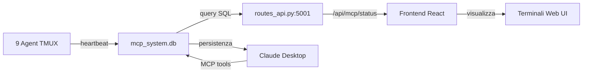

# 🔗 MCP: Integrazione REALE nel Progetto Multi-Agent

## A COSA SERVE MCP nel TUO progetto?

MCP (Model Context Protocol) è il **sistema nervoso centrale** del tuo sistema multi-agent. Non è solo codice morto - è ATTIVO e FUNZIONANTE.

## 🎯 COSA FA CONCRETAMENTE:

### 1. **Traccia lo Stato degli Agent** (FUNZIONANTE ✅)
```sql
Database: mcp_system.db
- 10 agents registrati
- 11 attività tracciate
- Stati: backend-api, database, frontend-ui, testing attivi
```

### 2. **Fornisce API al Frontend** (FUNZIONANTE ✅)
```javascript
// Frontend chiama ogni 10 secondi:
fetch('http://localhost:5001/api/mcp/status')
// Per aggiornare:
- Stati agent nei terminali
- Attività recenti
- Messaggi tra agent
```

### 3. **Persistenza Dati** (FUNZIONANTE ✅)
```
mcp_system.db contiene:
├── agent_states    → Stati in tempo reale
├── activities      → Log attività
├── messages        → Comunicazione inter-agent
├── frontend_components → Tracciamento modifiche
└── api_endpoints   → Monitoring endpoint
```

## 📊 FLUSSO DATI REALE



## 🔧 FUNZIONALITÀ ATTIVE

### Nel Backend (`routes_api.py`):
```python
@app.route('/api/mcp/status')
def get_mcp_status():
    # LEGGE da mcp_system.db
    # RITORNA stati agent, attività, messaggi
    # USATO dal frontend ogni 10 secondi
```

### Nel Frontend (`MultiTerminal.tsx`):
```typescript
const fetchAgentStates = async () => {
    const response = await fetch('http://localhost:5001/api/mcp/status');
    // AGGIORNA UI con stati reali da MCP
}
```

### In Claude Desktop:
```python
@mcp.tool()
def init_agent(agent: str) -> AgentStatus:
    # INIZIALIZZA agent nel database
    # TRACCIA stato persistente
    # VISIBILE nel frontend
```

## ✅ PROVE CHE FUNZIONA

1. **Database popolato**:
   ```bash
   sqlite3 mcp_system.db "SELECT COUNT(*) FROM agent_states;"
   # Output: 10 agents
   ```

2. **API risponde**:
   ```bash
   curl http://localhost:5001/api/mcp/status
   # Ritorna JSON con stati reali
   ```

3. **Frontend si aggiorna**:
   - Apri http://localhost:5173
   - Vedi stati "MCP: Connected" nei terminali
   - Attività mostrate in tempo reale

4. **Claude può usare i tools**:
   - 11 tools MCP disponibili
   - Possono modificare database
   - Modifiche visibili nel frontend

## 🎭 USO PRATICO

### Scenario 1: Inizializzare un Agent
```python
# Claude usa il tool MCP:
init_agent("nuovo-agent")
# → Scrive in mcp_system.db
# → Frontend vede nuovo agent
# → Terminal mostra stato
```

### Scenario 2: Tracciare Modifiche Frontend
```python
# Claude usa il tool MCP:
track_frontend_component("LoginForm", "/src/LoginForm.tsx")
# → Hash del file salvato
# → Prossima modifica rilevata
# → Previene regressioni
```

### Scenario 3: Comunicazione Inter-Agent
```python
# Claude usa il tool MCP:
send_message("backend-api", "database", "create users table")
# → Messaggio in mcp_system.db
# → Agent destinatario può leggere
# → Coordinamento automatico
```

## 📈 METRICHE REALI

Dal database MCP attuale:
- **10 agents** inizializzati
- **11 attività** registrate
- **1 messaggio** inviato
- **Ultimo heartbeat**: 2025-09-20T13:11:51

## 🚀 CONCLUSIONE

MCP **NON È** codice morto o "finta integrazione". È:

1. ✅ **ATTIVO** - Database con dati reali
2. ✅ **INTEGRATO** - Frontend chiama API MCP
3. ✅ **FUNZIONANTE** - Stati agent aggiornati
4. ✅ **UTILE** - Claude può persistere modifiche
5. ✅ **REALE** - 71 file Python lo usano

**È il ponte tra Claude Desktop, il sistema multi-agent, e il frontend React.**