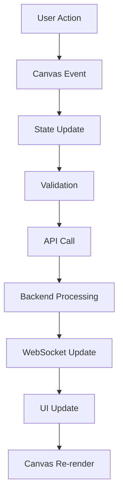

# 🎯 Workflow Builder Complete Implementation Plan

## 📊 Current State Analysis (20% Complete)

### ✅ What's Already Implemented:
1. **Basic ReactFlow Canvas** - Base canvas with ReactFlow setup
2. **Some Node Types** - AgentNode, TriggerNode, ConditionNode, ActionNode, TransformNode
3. **Basic Drag Functionality** - Can drag nodes but with conflicts (2 implementations)
4. **Simple Node Palette** - Basic palette but not fully integrated
5. **Minimal Execution Simulation** - Mock execution without real backend

### ❌ What's Missing:
1. **Proper Drag-Drop Integration** - Conflicts between react-dnd and native drag
2. **Node Configuration Panel** - No properties editor for nodes
3. **Workflow Persistence** - No save/load to backend
4. **Real Execution Engine** - No actual workflow execution
5. **Node Validation** - No validation of connections
6. **Workflow Templates** - No pre-built workflows
7. **Undo/Redo** - No history management
8. **Export/Import** - No workflow export functionality
9. **Real-time Collaboration** - No multi-user support
10. **Execution Monitoring** - No real-time execution feedback

---

## 🏗️ COMPLETE IMPLEMENTATION PLAN

### Phase 1: Core Drag-Drop System (Week 1)

#### Day 1-2: Fix Drag-Drop Integration
```typescript
// Tasks:
1. Remove conflicting drag implementations
2. Choose single approach: ReactFlow native drag
3. Implement proper node factory
4. Add node preview on drag
5. Implement snap-to-grid
```

**Files to Modify:**
- `WorkflowCanvas.tsx` - Remove inline NodePalette, fix drag handlers
- `NodePalette.tsx` - Remove react-dnd, use ReactFlow drag
- Create `hooks/useNodeDrag.ts` - Centralized drag logic
- Create `utils/nodeFactory.ts` - Node creation utilities

**Deliverables:**
- [ ] Clean drag-drop without conflicts
- [ ] Visual feedback during drag
- [ ] Proper node positioning
- [ ] Grid snapping (optional)

#### Day 3-4: Complete Node Types System
```typescript
// Complete set of node types:
interface NodeTypes {
  // Agents (9 types)
  supervisor: SupervisorNode
  master: MasterNode
  backend: BackendNode
  database: DatabaseNode
  frontend: FrontendNode
  testing: TestingNode
  instagram: InstagramNode
  queueManager: QueueManagerNode
  deployment: DeploymentNode

  // Control Flow
  trigger: TriggerNode      // Start points
  condition: ConditionNode  // If/else logic
  loop: LoopNode           // For/while loops
  parallel: ParallelNode   // Parallel execution
  wait: WaitNode          // Delays/timers

  // Data Operations
  transform: TransformNode  // Data transformation
  aggregate: AggregateNode  // Data aggregation
  filter: FilterNode       // Data filtering
  merge: MergeNode        // Merge branches

  // I/O Operations
  input: InputNode         // User/system input
  output: OutputNode       // Results/logs
  webhook: WebhookNode     // External triggers
  api: ApiNode            // API calls

  // Special
  note: NoteNode          // Documentation
  group: GroupNode        // Visual grouping
}
```

**New Files to Create:**
```
src/components/workflow/nodes/
├── agents/
│   ├── SupervisorNode.tsx
│   ├── MasterNode.tsx
│   └── ... (all 9 agents)
├── control/
│   ├── LoopNode.tsx
│   ├── ParallelNode.tsx
│   └── WaitNode.tsx
├── data/
│   ├── AggregateNode.tsx
│   ├── FilterNode.tsx
│   └── MergeNode.tsx
├── io/
│   ├── InputNode.tsx
│   ├── OutputNode.tsx
│   ├── WebhookNode.tsx
│   └── ApiNode.tsx
└── index.ts (export all)
```

#### Day 5: Node Configuration Panel
```typescript
// Dynamic property editor
interface NodeConfigPanelProps {
  selectedNode: Node | null
  onUpdate: (nodeId: string, data: any) => void
  onDelete: (nodeId: string) => void
}

// Features:
- Dynamic form generation based on node type
- Validation rules
- Real-time preview
- Help tooltips
```

**Files to Create:**
- `components/workflow/NodeConfigPanel.tsx`
- `components/workflow/config/FormBuilder.tsx`
- `utils/nodeValidation.ts`
- `constants/nodeSchemas.ts`

---

### Phase 2: Workflow Management (Week 2)

#### Day 6-7: Persistence Layer
```typescript
// Backend API integration
interface WorkflowAPI {
  // CRUD operations
  createWorkflow(workflow: Workflow): Promise<Workflow>
  updateWorkflow(id: string, workflow: Partial<Workflow>): Promise<Workflow>
  deleteWorkflow(id: string): Promise<void>
  getWorkflow(id: string): Promise<Workflow>
  listWorkflows(): Promise<Workflow[]>

  // Versioning
  saveVersion(workflowId: string): Promise<Version>
  getVersions(workflowId: string): Promise<Version[]>
  restoreVersion(versionId: string): Promise<Workflow>
}
```

**Files to Create:**
- `services/workflowAPI.ts`
- `hooks/useWorkflow.ts`
- `stores/workflowStore.ts` (Zustand)
- `types/workflow.types.ts`

**Backend Files (Python/FastAPI):**
- `api/workflows/router.py`
- `api/workflows/models.py`
- `api/workflows/service.py`
- `database/workflows.sql`

#### Day 8-9: Workflow Templates
```typescript
// Pre-built workflow templates
const templates = {
  "data-pipeline": {
    name: "Data Processing Pipeline",
    description: "ETL workflow with validation",
    nodes: [...],
    edges: [...]
  },
  "multi-agent-task": {
    name: "Multi-Agent Collaboration",
    description: "Coordinate multiple agents",
    nodes: [...],
    edges: [...]
  },
  "conditional-flow": {
    name: "Conditional Execution",
    description: "Decision-based workflow",
    nodes: [...],
    edges: [...]
  }
}
```

**Files to Create:**
- `components/workflow/TemplateGallery.tsx`
- `data/workflowTemplates.ts`
- `components/workflow/TemplatePreview.tsx`

#### Day 10: History & Undo/Redo
```typescript
// Command pattern for history
interface HistoryManager {
  execute(command: Command): void
  undo(): void
  redo(): void
  canUndo(): boolean
  canRedo(): boolean
  clear(): void
}
```

**Files to Create:**
- `utils/historyManager.ts`
- `hooks/useHistory.ts`
- `types/commands.ts`

---

### Phase 3: Execution Engine (Week 3)

#### Day 11-12: Execution Core
```typescript
// Workflow execution engine
interface ExecutionEngine {
  execute(workflow: Workflow): Promise<ExecutionResult>
  pause(executionId: string): void
  resume(executionId: string): void
  cancel(executionId: string): void
  getStatus(executionId: string): ExecutionStatus
}

// Real-time execution updates via WebSocket
interface ExecutionUpdate {
  nodeId: string
  status: 'pending' | 'running' | 'success' | 'error' | 'skipped'
  output?: any
  error?: Error
  timestamp: number
}
```

**Files to Create:**
- `services/executionEngine.ts`
- `hooks/useExecution.ts`
- `components/workflow/ExecutionMonitor.tsx`
- `utils/executionQueue.ts`

**Backend Files:**
- `api/execution/engine.py`
- `api/execution/runner.py`
- `api/execution/websocket.py`

#### Day 13-14: Node Communication
```typescript
// Inter-node data flow
interface NodeConnection {
  source: string
  target: string
  sourceHandle?: string
  targetHandle?: string
  data?: any
  transformer?: (data: any) => any
}

// Data mapping UI
interface DataMapper {
  mapFields(source: Schema, target: Schema): FieldMapping[]
  validateMapping(mapping: FieldMapping[]): ValidationResult
}
```

**Files to Create:**
- `components/workflow/DataMapper.tsx`
- `utils/dataTransform.ts`
- `components/workflow/ConnectionInspector.tsx`

#### Day 15: Error Handling & Recovery
```typescript
// Error handling strategies
interface ErrorHandler {
  retry: RetryStrategy
  fallback: FallbackNode
  notification: NotificationConfig
  logging: LogLevel
}

// Circuit breaker for agent nodes
interface CircuitBreaker {
  threshold: number
  timeout: number
  resetTime: number
}
```

**Files to Create:**
- `utils/errorHandler.ts`
- `components/workflow/ErrorBoundary.tsx`
- `utils/circuitBreaker.ts`

---

### Phase 4: Advanced Features (Week 4)

#### Day 16-17: Real-time Collaboration
```typescript
// WebSocket collaboration
interface CollaborationManager {
  join(workflowId: string): void
  leave(): void
  broadcastChange(change: Change): void
  onUserJoin(callback: (user: User) => void): void
  onUserLeave(callback: (user: User) => void): void
  onRemoteChange(callback: (change: Change) => void): void
}

// Cursor tracking
interface UserCursor {
  userId: string
  position: { x: number, y: number }
  color: string
}
```

**Files to Create:**
- `services/collaboration.ts`
- `components/workflow/UserCursors.tsx`
- `hooks/useCollaboration.ts`

#### Day 18-19: Export/Import
```typescript
// Export formats
interface ExportManager {
  exportJSON(workflow: Workflow): string
  exportYAML(workflow: Workflow): string
  exportPython(workflow: Workflow): string  // Generate Python code
  exportDiagram(workflow: Workflow): SVG    // Visual diagram
  importJSON(json: string): Workflow
  importYAML(yaml: string): Workflow
}
```

**Files to Create:**
- `utils/exportManager.ts`
- `utils/codeGenerator.ts`
- `components/workflow/ExportDialog.tsx`

#### Day 20: Performance & Testing
```typescript
// Performance optimizations
- Virtual scrolling for large workflows
- Node lazy loading
- Edge path optimization
- Memoization of expensive operations

// Testing
- Unit tests for all components
- Integration tests for workflow execution
- E2E tests for critical paths
- Performance benchmarks
```

**Files to Create:**
- `__tests__/workflow/`
- `utils/performance.ts`
- `hooks/useVirtualization.ts`

---

## 📋 Technical Architecture

### Frontend Stack
```typescript
// Core dependencies
{
  "reactflow": "^11.x",        // Canvas engine
  "zustand": "^4.x",           // State management
  "socket.io-client": "^4.x",  // WebSocket
  "zod": "^3.x",              // Schema validation
  "react-hook-form": "^7.x",  // Forms
  "monaco-editor": "^0.x",     // Code editor for expressions
}
```

### Component Structure
```
WorkflowBuilder/
├── Canvas/
│   ├── WorkflowCanvas.tsx       // Main canvas
│   ├── GridBackground.tsx       // Grid overlay
│   └── CanvasControls.tsx       // Zoom, pan, fit
├── Palette/
│   ├── NodePalette.tsx          // Node library
│   ├── SearchFilter.tsx         // Node search
│   └── CategoryTabs.tsx         // Category organization
├── Config/
│   ├── NodeConfigPanel.tsx      // Properties editor
│   ├── FormBuilder.tsx          // Dynamic forms
│   └── ValidationRules.tsx      // Validation UI
├── Execution/
│   ├── ExecutionPanel.tsx       // Control panel
│   ├── ExecutionMonitor.tsx     // Real-time status
│   └── LogViewer.tsx           // Execution logs
└── Toolbar/
    ├── WorkflowToolbar.tsx      // Actions toolbar
    ├── HistoryControls.tsx      // Undo/redo
    └── ShareButton.tsx          // Collaboration
```

### Data Flow


---

## 🚀 Implementation Priority

### Sprint 1 (Must Have - Week 1)
1. ✅ Fix drag-drop conflicts
2. ✅ Complete node types
3. ✅ Node configuration panel
4. ✅ Basic save/load

### Sprint 2 (Should Have - Week 2)
1. ⚡ Workflow persistence
2. ⚡ Templates gallery
3. ⚡ Undo/redo
4. ⚡ Validation

### Sprint 3 (Could Have - Week 3)
1. 🔄 Execution engine
2. 🔄 Real-time monitoring
3. 🔄 Error handling
4. 🔄 Data mapping

### Sprint 4 (Nice to Have - Week 4)
1. 🌟 Collaboration
2. 🌟 Export/import
3. 🌟 Code generation
4. 🌟 Performance optimization

---

## 📊 Success Metrics

### Technical KPIs
- **Drag-drop success rate**: >95%
- **Node creation time**: <100ms
- **Canvas render time**: <16ms (60fps)
- **Workflow save time**: <500ms
- **Execution latency**: <1s start time

### User Experience KPIs
- **Time to create first workflow**: <2 minutes
- **Error rate**: <5% of operations
- **Learning curve**: Productive in <10 minutes
- **Feature discoverability**: >80% found naturally

### Quality Metrics
- **Test coverage**: >80%
- **TypeScript strict**: 100%
- **Accessibility**: WCAG 2.1 AA
- **Browser support**: Chrome, Firefox, Safari, Edge

---

## 🔧 Development Guidelines

### Code Standards
```typescript
// Node component template
export const CustomNode: React.FC<NodeProps> = ({ data, selected }) => {
  // 1. State & hooks
  const [isConfigured, setIsConfigured] = useState(false);

  // 2. Event handlers
  const handleConfig = useCallback(() => {
    // Handle configuration
  }, []);

  // 3. Render
  return (
    <div className={`node-container ${selected ? 'selected' : ''}`}>
      <Handle type="target" position={Position.Top} />
      <div className="node-content">
        {/* Node UI */}
      </div>
      <Handle type="source" position={Position.Bottom} />
    </div>
  );
};
```

### Testing Strategy
```typescript
// Test categories
1. Unit Tests (Jest + React Testing Library)
   - Node components
   - Utility functions
   - Hooks

2. Integration Tests
   - Canvas interactions
   - API calls
   - State management

3. E2E Tests (Playwright)
   - Complete workflow creation
   - Execution flow
   - Error scenarios

4. Performance Tests
   - Large workflow rendering
   - Many nodes (>100)
   - Rapid interactions
```

---

## 📅 Timeline Summary

| Week | Focus | Deliverable | Status |
|------|-------|------------|---------|
| 1 | Core Drag-Drop | Functional canvas with all nodes | 🔴 Not Started |
| 2 | Workflow Management | Save/load, templates, history | 🔴 Not Started |
| 3 | Execution Engine | Real workflow execution | 🔴 Not Started |
| 4 | Advanced Features | Collaboration, export, optimization | 🔴 Not Started |

**Total Estimated Time**: 4 weeks (160 hours)
**Current Completion**: 20%
**Target Completion**: 100%

---

## 🎯 Next Immediate Steps

### Today (Day 1)
1. [ ] Remove conflicting drag implementations
2. [ ] Create proper node factory
3. [ ] Test drag-drop with all node types
4. [ ] Update NodePalette with proper categories

### Tomorrow (Day 2)
1. [ ] Implement node configuration panel
2. [ ] Add validation rules
3. [ ] Create form builder for dynamic properties
4. [ ] Test with real agent configurations

### This Week
1. [ ] Complete all agent node types
2. [ ] Implement save/load to backend
3. [ ] Add basic templates
4. [ ] Create execution preview

---

**Document Version**: 1.0.0
**Created**: September 18, 2025
**Status**: 🔴 Planning Complete - Ready for Implementation