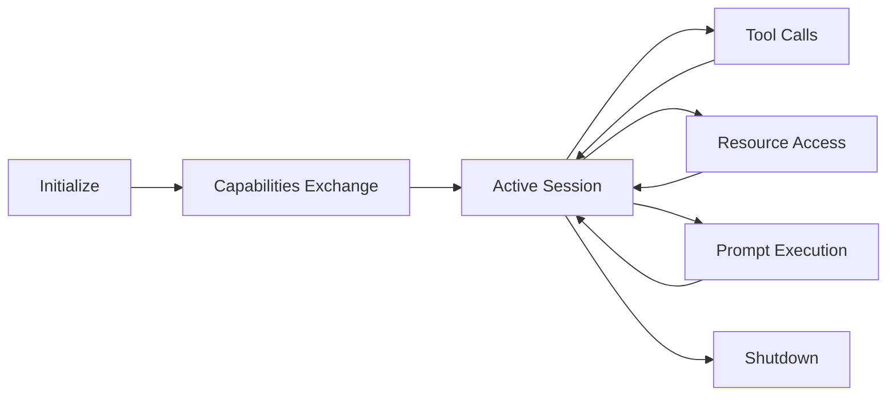

# MCP v2 Protocol Implementation

## Overview

The Model Context Protocol (MCP) v2 provides standardized communication between the Claude agents and external systems. This implementation follows the official MCP specification with enhanced security features.

## Protocol Specification

### Version
- **Protocol Version**: 2.0
- **Specification Date**: 2025-06-18
- **Implementation**: Full compliance with extensions

### Transport Layer
- **Primary**: HTTP/HTTPS with JSON-RPC 2.0
- **Real-time**: WebSocket for push notifications
- **Fallback**: Long-polling for compatibility

## Core Components

### 1. Tools

Tools allow agents to execute actions in external systems.

#### Tool Definition

```json
{
  "name": "execute_query",
  "description": "Execute a database query",
  "inputSchema": {
    "type": "object",
    "properties": {
      "query": {
        "type": "string",
        "description": "SQL query to execute"
      },
      "database": {
        "type": "string",
        "description": "Target database"
      }
    },
    "required": ["query"]
  }
}
```

#### Tool Invocation

```json
{
  "jsonrpc": "2.0",
  "method": "tools/call",
  "params": {
    "name": "execute_query",
    "arguments": {
      "query": "SELECT * FROM users",
      "database": "main"
    }
  },
  "id": 1
}
```

### 2. Resources

Resources provide access to external data sources.

#### List Resources

```json
{
  "jsonrpc": "2.0",
  "method": "resources/list",
  "id": 1
}
```

**Response:**
```json
{
  "jsonrpc": "2.0",
  "result": {
    "resources": [
      {
        "uri": "file:///project/README.md",
        "name": "Project README",
        "mimeType": "text/markdown"
      }
    ]
  },
  "id": 1
}
```

#### Read Resource

```json
{
  "jsonrpc": "2.0",
  "method": "resources/read",
  "params": {
    "uri": "file:///project/README.md"
  },
  "id": 2
}
```

### 3. Prompts

Prompts provide reusable templates for agent interactions.

#### Get Prompt

```json
{
  "jsonrpc": "2.0",
  "method": "prompts/get",
  "params": {
    "name": "code_review"
  },
  "id": 3
}
```

**Response:**
```json
{
  "jsonrpc": "2.0",
  "result": {
    "description": "Review code for quality",
    "arguments": [
      {
        "name": "code",
        "description": "Code to review",
        "required": true
      }
    ],
    "messages": [
      {
        "role": "system",
        "content": "You are a code reviewer..."
      }
    ]
  },
  "id": 3
}
```

## Authentication

### OAuth 2.1 Flow

1. **Authorization Request**
```http
GET /oauth/authorize?
  client_id=claude-agent&
  response_type=code&
  redirect_uri=http://localhost:9999/callback&
  scope=tools.execute+resources.read
```

2. **Token Exchange**
```http
POST /oauth/token
Content-Type: application/x-www-form-urlencoded

grant_type=authorization_code&
code=AUTH_CODE&
client_id=claude-agent&
client_secret=SECRET
```

3. **Use Token**
```json
{
  "jsonrpc": "2.0",
  "method": "initialize",
  "params": {
    "protocolVersion": "2025-06-18",
    "capabilities": {
      "tools": {},
      "resources": {},
      "prompts": {}
    },
    "clientInfo": {
      "name": "claude-agent",
      "version": "1.0.0"
    },
    "authorization": {
      "token": "Bearer eyJhbGciOiJ..."
    }
  },
  "id": 1
}
```

## Session Management

### Initialize Session

```json
{
  "jsonrpc": "2.0",
  "method": "initialize",
  "params": {
    "protocolVersion": "2025-06-18",
    "capabilities": {
      "tools": {},
      "resources": {
        "subscribe": true
      },
      "prompts": {}
    }
  },
  "id": 1
}
```

### Session Lifecycle



## Security Features

### Request Signing

All requests include HMAC signature:

```python
signature = hmac.new(
    secret_key.encode(),
    f"{method}{timestamp}{body}".encode(),
    hashlib.sha256
).hexdigest()

headers = {
    "X-MCP-Signature": signature,
    "X-MCP-Timestamp": timestamp
}
```

### Rate Limiting

```json
{
  "jsonrpc": "2.0",
  "error": {
    "code": -32000,
    "message": "Rate limit exceeded",
    "data": {
      "limit": 100,
      "remaining": 0,
      "reset": 1737280000
    }
  },
  "id": 1
}
```

### Audit Logging

All MCP operations are logged:

```sql
CREATE TABLE mcp_audit_log (
    id INTEGER PRIMARY KEY,
    timestamp DATETIME,
    session_id TEXT,
    method TEXT,
    params TEXT,
    result TEXT,
    error TEXT,
    duration_ms INTEGER
);
```

## Error Handling

### Standard Error Codes

| Code | Message | Description |
|------|---------|-------------|
| -32700 | Parse error | Invalid JSON |
| -32600 | Invalid request | Invalid JSON-RPC |
| -32601 | Method not found | Unknown method |
| -32602 | Invalid params | Invalid parameters |
| -32603 | Internal error | Server error |
| -32000 | Server error | Custom errors |

### Error Response

```json
{
  "jsonrpc": "2.0",
  "error": {
    "code": -32601,
    "message": "Method not found",
    "data": {
      "method": "unknown/method",
      "available_methods": [
        "tools/list",
        "tools/call",
        "resources/list",
        "resources/read"
      ]
    }
  },
  "id": 1
}
```

## Extension: Consent Flow

Custom extension for user consent:

```json
{
  "jsonrpc": "2.0",
  "method": "consent/request",
  "params": {
    "action": "file_write",
    "details": {
      "path": "/etc/config.yml",
      "content": "..."
    },
    "risk_level": "high"
  },
  "id": 1
}
```

**User Response:**
```json
{
  "jsonrpc": "2.0",
  "result": {
    "granted": true,
    "remember": false,
    "expires_at": "2025-01-20T00:00:00Z"
  },
  "id": 1
}
```

## Performance Metrics

### Response Time Requirements
- **P50**: < 100ms
- **P95**: < 500ms
- **P99**: < 2000ms

### Monitoring Endpoints

```http
GET /mcp/metrics

{
  "requests_total": 10000,
  "requests_per_second": 50,
  "average_response_time_ms": 85,
  "active_sessions": 9,
  "error_rate": 0.002
}
```