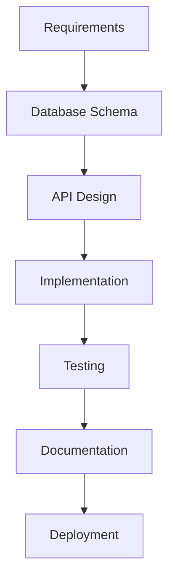

# Common Workflows

## Task Distribution Workflow

### 1. Simple Task Assignment

**Scenario**: Assign a single task to a specific agent

```bash
# Direct assignment via supervisor
python3 quick_task.py "Implement user login API" backend-api

# Or via MCP
curl -X POST http://localhost:5001/api/tasks \
  -H "Authorization: Bearer $TOKEN" \
  -H "Content-Type: application/json" \
  -d '{
    "title": "Implement user login API",
    "assigned_to": "backend-api",
    "priority": "high"
  }'
```

### 2. Complex Multi-Agent Task

**Scenario**: Build a complete feature requiring multiple agents

```python
# Step 1: Create master task
master_task = {
    "title": "Build user dashboard",
    "description": "Complete dashboard with backend and frontend",
    "subtasks": [
        {
            "agent": "database",
            "task": "Design dashboard data schema"
        },
        {
            "agent": "backend-api",
            "task": "Create dashboard API endpoints",
            "depends_on": ["database"]
        },
        {
            "agent": "frontend-ui",
            "task": "Build React dashboard components",
            "depends_on": ["backend-api"]
        },
        {
            "agent": "testing",
            "task": "Write dashboard tests",
            "depends_on": ["frontend-ui"]
        }
    ]
}

# Step 2: Submit to supervisor
submit_complex_task(master_task)
```

## Development Workflows

### 1. API Development Flow



**Commands**:

```bash
# 1. Database schema
tmux send-keys -t claude-database \
  "Design schema for user profiles with posts and comments" Enter

# 2. API implementation
tmux send-keys -t claude-backend-api \
  "Implement CRUD API for user profiles" Enter

# 3. Testing
tmux send-keys -t claude-testing \
  "Create test suite for profile API" Enter

# 4. Deploy
tmux send-keys -t claude-deployment \
  "Deploy profile API to staging" Enter
```

### 2. Frontend Feature Flow

```bash
# 1. UI/UX Design
curl -X POST http://localhost:5001/api/agents/frontend-ui/message \
  -H "Content-Type: application/json" \
  -d '{"message": "Design user profile page mockup"}'

# 2. Component Development
curl -X POST http://localhost:5001/api/agents/frontend-ui/message \
  -H "Content-Type: application/json" \
  -d '{"message": "Implement ProfileCard component with React"}'

# 3. Integration
curl -X POST http://localhost:5001/api/agents/frontend-ui/message \
  -H "Content-Type: application/json" \
  -d '{"message": "Connect ProfileCard to backend API"}'
```

## Debugging Workflows

### 1. Bug Investigation

**Step 1**: Report bug to supervisor
```bash
python3 supervisor_agent.py investigate "Users cannot login on mobile devices"
```

**Step 2**: Supervisor delegates investigation
- Frontend UI: Check responsive design
- Backend API: Verify CORS headers
- Testing: Add mobile test cases

**Step 3**: Coordinate fix
```python
fix_plan = {
    "bug_id": "BUG-123",
    "root_cause": "Missing mobile viewport meta tag",
    "fix_agents": ["frontend-ui"],
    "verify_agents": ["testing"]
}
```

### 2. Performance Optimization

```bash
# 1. Identify bottleneck
tmux send-keys -t claude-supervisor \
  "Analyze slow API response times for /users endpoint" Enter

# 2. Database optimization
tmux send-keys -t claude-database \
  "Optimize queries and add indexes for users table" Enter

# 3. Backend optimization
tmux send-keys -t claude-backend-api \
  "Implement caching for user queries" Enter

# 4. Verify improvements
tmux send-keys -t claude-testing \
  "Run performance tests on optimized endpoints" Enter
```

## Deployment Workflows

### 1. Standard Deployment

```bash
# 1. Pre-deployment checks
./scripts/pre_deploy_check.sh

# 2. Deploy to staging
python3 deployment_agent.py deploy staging

# 3. Run tests
python3 testing_agent.py test staging

# 4. Deploy to production
python3 deployment_agent.py deploy production

# 5. Monitor
python3 monitoring.py watch production
```

### 2. Emergency Hotfix

```bash
# 1. Activate emergency mode
tmux send-keys -t claude-master "EMERGENCY: Critical bug in production" Enter

# 2. Fast-track fix
tmux send-keys -t claude-backend-api "HOTFIX: Fix authentication bypass" Enter

# 3. Emergency testing
tmux send-keys -t claude-testing "URGENT: Test hotfix authentication" Enter

# 4. Deploy immediately
tmux send-keys -t claude-deployment "EMERGENCY DEPLOY: Push hotfix now" Enter
```

## Monitoring Workflows

### 1. Daily Health Check

```python
def daily_health_check():
    # Check all agents
    agents = ['supervisor', 'master', 'backend-api', 'database',
              'frontend-ui', 'testing', 'queue-manager', 'instagram',
              'deployment']

    for agent in agents:
        status = check_agent_health(agent)
        if status != 'healthy':
            alert_supervisor(agent, status)

    # Check system metrics
    metrics = get_system_metrics()
    if metrics['cpu'] > 80 or metrics['memory'] > 90:
        trigger_scaling()

    # Generate report
    generate_daily_report()
```

### 2. Real-time Monitoring

```javascript
// Dashboard monitoring
const monitorAgents = () => {
  setInterval(async () => {
    const agents = await fetch('/api/agents/status');
    updateDashboard(agents);

    // Alert on issues
    agents.forEach(agent => {
      if (agent.status === 'error') {
        showAlert(`Agent ${agent.name} is down!`);
      }
    });
  }, 2000); // Check every 2 seconds
};
```

## Integration Workflows

### 1. Third-party Service Integration

```bash
# Example: Instagram API integration

# 1. Design integration architecture
tmux send-keys -t claude-supervisor \
  "Plan Instagram content automation integration" Enter

# 2. Implement OAuth flow
tmux send-keys -t claude-backend-api \
  "Implement Instagram OAuth 2.0 authentication" Enter

# 3. Create integration service
tmux send-keys -t claude-instagram \
  "Build Instagram posting automation service" Enter

# 4. Add UI controls
tmux send-keys -t claude-frontend-ui \
  "Create Instagram management dashboard" Enter
```

### 2. Database Migration

```bash
# 1. Plan migration
tmux send-keys -t claude-database \
  "Plan migration from SQLite to PostgreSQL" Enter

# 2. Create migration scripts
tmux send-keys -t claude-database \
  "Generate migration scripts for all tables" Enter

# 3. Test migration
tmux send-keys -t claude-testing \
  "Test database migration in staging" Enter

# 4. Execute migration
tmux send-keys -t claude-deployment \
  "Execute database migration with zero downtime" Enter
```

## Best Practices

### Task Prioritization

1. **Critical** (P0): Production issues, security vulnerabilities
2. **High** (P1): User-facing features, major bugs
3. **Medium** (P2): Enhancements, optimizations
4. **Low** (P3): Documentation, refactoring

### Communication Patterns

```python
# Good: Specific, measurable task
"Implement POST /api/users endpoint with validation for email and password"

# Bad: Vague request
"Make the API better"

# Good: Clear dependencies
"After database schema is ready, implement user CRUD operations"

# Bad: No context
"Fix the bug"
```

### Error Recovery

```bash
# If agent fails
1. Check agent status
tmux attach -t claude-{agent-name}

2. Restart if needed
tmux kill-session -t claude-{agent-name}
./scripts/restart_agent.sh {agent-name}

3. Reassign task
python3 supervisor_agent.py reassign {task-id} {new-agent}
```