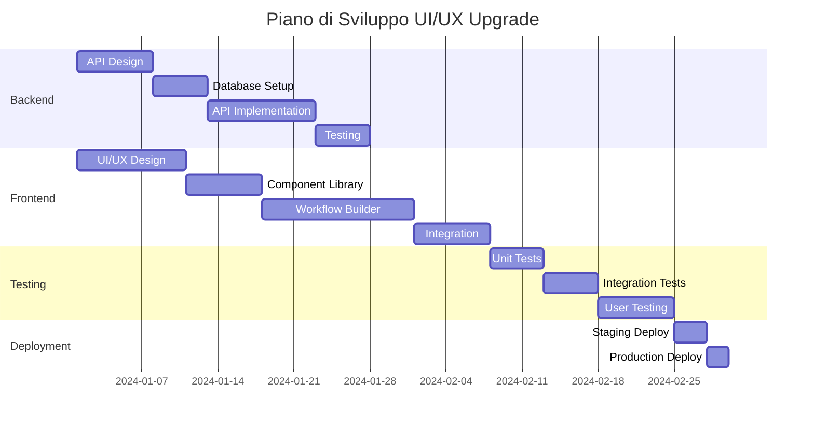

# 🚀 Piano Completo di Upgrade UI/UX - Claude Multi-Agent System

## 📊 ANALISI STATO ATTUALE

### Interfaccia Attiva: complete_integration.py (localhost:8501)

L'interfaccia attualmente in esecuzione è **complete_integration.py**, che rappresenta il sistema più avanzato presente nel progetto. Analisi dettagliata delle funzionalità:

#### 🎯 Funzionalità Esistenti Mappate

1. **Agent Control Center** (7 agenti)
   - Supervisor Agent (porta 8089)
   - Master Agent (porta 8088)
   - Backend API Agent (porta 8090)
   - Database Agent (porta 8091)
   - Frontend UI Agent (porta 8092)
   - Instagram Agent (porta 8093)
   - Testing Agent (porta 8094)

2. **Sistema di Tab Esistenti**
   - Mission Control
   - Agent Terminals
   - LangGraph Studio
   - Analytics
   - Request Manager
   - Instructions Editor
   - Messaging Center

3. **Integrazioni Attive**
   - SharedStateManager (JSON persistence)
   - TMUXClient per controllo terminali
   - LangGraph API (porta 8080)
   - ttyd terminals (porte 8088-8094)
   - MessagingSystem con inbox per agenti
   - AgentCreator per creazione dinamica
   - TaskCompletionMonitor
   - AgentRequestManager con monitor

4. **Features Avanzate Già Presenti**
   - Stati condivisi tra agenti
   - Sistema di messaggistica inter-agente
   - Creazione agenti dinamica con wizard
   - Analytics con grafici Plotly
   - Editor istruzioni agenti
   - Request management system
   - Task monitoring real-time

## 🔴 GAP CRITICI IDENTIFICATI

### 1. **MANCA COMPLETAMENTE: Workflow Builder Visuale**
   - ❌ NO drag-and-drop interface
   - ❌ NO visual node editor
   - ❌ NO workflow canvas stile n8n/Node-RED
   - ❌ Solo workflow predefiniti text-based

### 2. **UI Limitata da Streamlit**
   - ❌ NO componenti custom interattivi
   - ❌ Refresh manuale richiesto
   - ❌ Layout rigido (no free positioning)
   - ❌ Performance issues con molti componenti

### 3. **Architettura Non Scalabile**
   - ❌ Monolitico (900+ linee in un file)
   - ❌ NO microservices
   - ❌ NO API REST documentata
   - ❌ Stato locale non distribuito

## 🎨 NUOVO DESIGN PROPOSTO - STILE N8N

### 1. Workflow Builder Drag-and-Drop

```typescript
interface WorkflowNode {
  id: string;
  type: 'agent' | 'trigger' | 'condition' | 'action' | 'merge';
  position: { x: number; y: number };
  data: {
    agent?: string;
    task?: string;
    parameters?: Record<string, any>;
    conditions?: ConditionSet[];
  };
  inputs: NodePort[];
  outputs: NodePort[];
}

interface WorkflowConnection {
  id: string;
  source: { nodeId: string; portId: string };
  target: { nodeId: string; portId: string };
  type: 'data' | 'execution';
  conditions?: ConnectionCondition[];
}
```

### 2. Architettura Microservices

```
┌─────────────────────────────────────────────────────────┐
│                   FRONTEND (React/Next.js)              │
├─────────────────────────────────────────────────────────┤
│                                                         │
│  ┌──────────────┐  ┌──────────────┐  ┌──────────────┐ │
│  │   Workflow   │  │   Agent      │  │  Analytics   │ │
│  │   Builder    │  │   Control    │  │  Dashboard   │ │
│  │   (n8n-like) │  │   Center     │  │              │ │
│  └──────────────┘  └──────────────┘  └──────────────┘ │
│                                                         │
├─────────────────────────────────────────────────────────┤
│                    API GATEWAY (FastAPI)                │
├─────────────────────────────────────────────────────────┤
│                                                         │
│  ┌──────────┐  ┌──────────┐  ┌──────────┐  ┌────────┐ │
│  │ Workflow │  │  Agent   │  │ Message  │  │ Task   │ │
│  │ Service  │  │ Service  │  │ Service  │  │Service │ │
│  └──────────┘  └──────────┘  └──────────┘  └────────┘ │
│                                                         │
├─────────────────────────────────────────────────────────┤
│                  DATA LAYER                             │
│  ┌──────────┐  ┌──────────┐  ┌──────────┐             │
│  │PostgreSQL│  │  Redis   │  │  MinIO   │             │
│  │(Workflow)│  │ (Cache)  │  │ (Files)  │             │
│  └──────────┘  └──────────┘  └──────────┘             │
└─────────────────────────────────────────────────────────┘
```

## 📐 WORKFLOW BUILDER DETTAGLIATO (STILE N8N)

### Interface Design

```
┌────────────────────────────────────────────────────────────────┐
│  Workflow Editor - Authentication Flow                   [✕]   │
├────────────────────────────────────────────────────────────────┤
│ ┌──────────────────────────────────────────────────────────┐  │
│ │ 🔧 Node Palette                                          │  │
│ │ ┌─────────┐ ┌─────────┐ ┌─────────┐ ┌─────────┐       │  │
│ │ │ Trigger │ │  Agent  │ │Condition│ │ Action  │       │  │
│ │ └─────────┘ └─────────┘ └─────────┘ └─────────┘       │  │
│ └──────────────────────────────────────────────────────────┘  │
│                                                                │
│ ┌──────────────────────────────────────────────────────────┐  │
│ │                    CANVAS (Draggable/Zoomable)           │  │
│ │                                                           │  │
│ │   ┌─────────┐      ┌──────────┐      ┌──────────┐      │  │
│ │   │  HTTP   │─────▶│ Backend  │─────▶│   IF     │      │  │
│ │   │ Trigger │      │   API    │      │Condition │      │  │
│ │   └─────────┘      └──────────┘      └────┬─────┘      │  │
│ │                                            │             │  │
│ │                                     ┌──────▼─────┐      │  │
│ │                                     │  Database  │      │  │
│ │                                     │   Agent    │      │  │
│ │                                     └────────────┘      │  │
│ └──────────────────────────────────────────────────────────┘  │
│                                                                │
│ ┌──────────────────────────────────────────────────────────┐  │
│ │ Properties Panel                                          │  │
│ │ Node: Backend API Agent                                  │  │
│ │ ┌────────────────────────────────────────────────────┐   │  │
│ │ │ Task: Create authentication endpoint               │   │  │
│ │ │ Parameters:                                        │   │  │
│ │ │   - Method: POST                                   │   │  │
│ │ │   - Route: /api/auth/login                        │   │  │
│ │ │   - Validation: JWT                               │   │  │
│ │ └────────────────────────────────────────────────────┘   │  │
│ └──────────────────────────────────────────────────────────┘  │
└────────────────────────────────────────────────────────────────┘
```

### Node Types

#### 1. **Trigger Nodes** (Eventi di Avvio)
- HTTP Request
- Scheduled (Cron)
- Webhook
- Manual Start
- File Watcher
- Database Change
- Message Queue

#### 2. **Agent Nodes** (Esecutori)
- Backend API Agent
- Database Agent
- Frontend UI Agent
- Testing Agent
- Custom Agents (dinamici)

#### 3. **Logic Nodes** (Controllo Flusso)
- IF Condition
- Switch/Case
- Loop
- Merge
- Split
- Wait/Delay
- Error Handler

#### 4. **Action Nodes** (Operazioni)
- HTTP Request
- Database Query
- File Operations
- Email Send
- Notification
- Transform Data
- Execute Script

### Esempio Workflow Complesso

```yaml
name: "E-commerce Order Processing"
nodes:
  - id: "trigger_1"
    type: "webhook"
    config:
      endpoint: "/orders/new"

  - id: "validation_1"
    type: "agent"
    agent: "backend-api"
    task: "Validate order data"

  - id: "condition_1"
    type: "if"
    condition: "order.amount > 1000"

  - id: "fraud_check"
    type: "agent"
    agent: "security"
    task: "Run fraud detection"

  - id: "database_1"
    type: "agent"
    agent: "database"
    task: "Store order in database"

  - id: "inventory_1"
    type: "agent"
    agent: "backend-api"
    task: "Update inventory"

  - id: "notification_1"
    type: "action"
    action: "send_email"
    template: "order_confirmation"

connections:
  - from: "trigger_1"
    to: "validation_1"
  - from: "validation_1"
    to: "condition_1"
  - from: "condition_1.true"
    to: "fraud_check"
  - from: "condition_1.false"
    to: "database_1"
  - from: "fraud_check.passed"
    to: "database_1"
  - from: "database_1"
    to: "inventory_1"
  - from: "inventory_1"
    to: "notification_1"
```

## 🏗️ PIANO DI IMPLEMENTAZIONE

### FASE 1: Backend API (Settimane 1-2)

#### 1.1 FastAPI Backend
```python
# main.py
from fastapi import FastAPI
from fastapi.middleware.cors import CORSMiddleware

app = FastAPI(title="Claude Multi-Agent API")

# Endpoints
- POST /api/workflows - Create workflow
- GET /api/workflows - List workflows
- GET /api/workflows/{id} - Get workflow
- PUT /api/workflows/{id} - Update workflow
- DELETE /api/workflows/{id} - Delete workflow
- POST /api/workflows/{id}/execute - Execute workflow
- GET /api/workflows/{id}/status - Execution status

- GET /api/agents - List agents
- POST /api/agents/{id}/execute - Execute agent task
- GET /api/agents/{id}/status - Agent status
- GET /api/agents/{id}/logs - Agent logs

- WebSocket /ws/updates - Real-time updates
```

#### 1.2 Database Schema
```sql
-- PostgreSQL
CREATE TABLE workflows (
    id UUID PRIMARY KEY,
    name VARCHAR(255),
    description TEXT,
    nodes JSONB,
    connections JSONB,
    created_at TIMESTAMP,
    updated_at TIMESTAMP,
    created_by UUID REFERENCES users(id)
);

CREATE TABLE executions (
    id UUID PRIMARY KEY,
    workflow_id UUID REFERENCES workflows(id),
    status VARCHAR(50),
    started_at TIMESTAMP,
    completed_at TIMESTAMP,
    result JSONB,
    logs TEXT[]
);

CREATE TABLE agents (
    id VARCHAR(100) PRIMARY KEY,
    name VARCHAR(255),
    type VARCHAR(50),
    capabilities JSONB,
    status VARCHAR(50),
    last_activity TIMESTAMP
);
```

### FASE 2: Frontend React (Settimane 3-4)

#### 2.1 Tech Stack
```json
{
  "dependencies": {
    "react": "^18.2.0",
    "next": "^14.0.0",
    "typescript": "^5.0.0",
    "reactflow": "^11.10.0",  // For workflow builder
    "zustand": "^4.4.0",       // State management
    "tanstack-query": "^5.0.0", // Data fetching
    "tailwindcss": "^3.3.0",
    "radix-ui": "^1.0.0",     // UI components
    "recharts": "^2.8.0",      // Analytics charts
    "socket.io-client": "^4.5.0", // WebSocket
    "monaco-editor": "^0.44.0"  // Code editor
  }
}
```

#### 2.2 Component Structure
```
src/
├── app/
│   ├── layout.tsx
│   ├── page.tsx
│   ├── workflows/
│   │   ├── page.tsx
│   │   ├── [id]/
│   │   │   ├── page.tsx
│   │   │   └── edit/page.tsx
│   ├── agents/
│   └── analytics/
├── components/
│   ├── workflow/
│   │   ├── WorkflowCanvas.tsx
│   │   ├── NodePalette.tsx
│   │   ├── NodeTypes/
│   │   │   ├── AgentNode.tsx
│   │   │   ├── TriggerNode.tsx
│   │   │   ├── ConditionNode.tsx
│   │   │   └── ActionNode.tsx
│   │   ├── PropertiesPanel.tsx
│   │   └── WorkflowToolbar.tsx
│   ├── agents/
│   │   ├── AgentCard.tsx
│   │   ├── AgentStatus.tsx
│   │   └── AgentTerminal.tsx
│   └── shared/
│       ├── Layout.tsx
│       ├── Sidebar.tsx
│       └── Header.tsx
├── hooks/
│   ├── useWorkflow.ts
│   ├── useAgents.ts
│   └── useWebSocket.ts
├── store/
│   ├── workflowStore.ts
│   └── agentStore.ts
└── lib/
    ├── api.ts
    └── utils.ts
```

### FASE 3: Workflow Engine (Settimane 5-6)

#### 3.1 Execution Engine
```python
# workflow_engine.py
class WorkflowEngine:
    def __init__(self):
        self.executor = ThreadPoolExecutor(max_workers=10)
        self.running_workflows = {}

    async def execute_workflow(self, workflow_id: str):
        workflow = await load_workflow(workflow_id)
        execution = WorkflowExecution(workflow)

        # Topological sort dei nodi
        sorted_nodes = self.topological_sort(workflow.nodes)

        # Esecuzione asincrona
        for node in sorted_nodes:
            if node.type == 'agent':
                await self.execute_agent_node(node)
            elif node.type == 'condition':
                await self.evaluate_condition(node)
            elif node.type == 'action':
                await self.execute_action(node)

    async def execute_agent_node(self, node):
        agent = self.get_agent(node.agent_id)
        result = await agent.execute_task(node.task)
        return result
```

### FASE 4: Integration & Testing (Settimane 7-8)

#### 4.1 Integration Points
- Connect to existing TMUX sessions
- Integrate SharedStateManager
- Connect MessagingSystem
- Preserve existing agent instructions

#### 4.2 Migration Strategy
1. Run new system parallel to old
2. Gradual feature migration
3. Data migration scripts
4. Rollback plan

## 📊 CONFRONTO FUNZIONALITÀ

| Feature | Sistema Attuale (Streamlit) | Sistema Proposto (React + n8n-style) |
|---------|----------------------------|--------------------------------------|
| **Workflow Builder** | ❌ Text-based only | ✅ Visual drag-drop canvas |
| **Real-time Updates** | ❌ Manual refresh | ✅ WebSocket automatic |
| **Scalability** | ❌ Monolithic | ✅ Microservices |
| **Performance** | ⚠️ Limited by Streamlit | ✅ Optimized React |
| **Custom Components** | ❌ Not possible | ✅ Full customization |
| **API** | ❌ No REST API | ✅ Full REST + GraphQL |
| **Mobile Support** | ⚠️ Basic responsive | ✅ Native mobile app ready |
| **Workflow Templates** | ❌ Hardcoded | ✅ Dynamic library |
| **Version Control** | ❌ No versioning | ✅ Git-like versioning |
| **Collaboration** | ❌ Single user | ✅ Multi-user real-time |
| **Export/Import** | ❌ Not available | ✅ JSON/YAML export |
| **Testing** | ❌ Manual only | ✅ Automated testing |
| **Monitoring** | ⚠️ Basic metrics | ✅ Full observability |
| **Documentation** | ❌ External only | ✅ In-app interactive |

## 🎯 DELIVERABLES FINALI

### 1. Workflow Builder (Priorità Massima)
- Canvas drag-drop stile n8n
- 20+ node types predefiniti
- Custom node creation
- Workflow templates library
- Import/Export workflows
- Version control
- Collaborative editing

### 2. Backend API Platform
- RESTful API completa
- GraphQL endpoint
- WebSocket real-time
- Authentication/Authorization
- Rate limiting
- API documentation (OpenAPI)

### 3. Frontend Application
- React 18 + TypeScript
- Server-side rendering (Next.js)
- Progressive Web App
- Offline support
- Mobile responsive
- Dark/Light theme

### 4. Agent Management
- Visual agent status
- Terminal integration
- Log streaming
- Performance metrics
- Resource monitoring
- Alert system

### 5. Analytics Dashboard
- Real-time metrics
- Historical data
- Custom reports
- Export capabilities
- Predictive analytics
- Anomaly detection

## 🚀 TIMELINE COMPLETA



## 💰 STIMA RISORSE

### Team Richiesto
- 1 UI/UX Designer
- 2 Frontend Developers (React)
- 2 Backend Developers (Python/FastAPI)
- 1 DevOps Engineer
- 1 QA Engineer

### Tempo Stimato
- **MVP**: 4 settimane
- **Full Version**: 8 settimane
- **Enterprise Features**: 12 settimane

### Stack Tecnologico
- **Frontend**: React, Next.js, TypeScript, TailwindCSS, ReactFlow
- **Backend**: FastAPI, PostgreSQL, Redis, Celery
- **Infrastructure**: Docker, Kubernetes, AWS/GCP
- **Monitoring**: Prometheus, Grafana, Sentry
- **CI/CD**: GitHub Actions, ArgoCD

## ✅ SUCCESS METRICS

1. **Performance**
   - Page load < 2s
   - Workflow execution latency < 100ms
   - 99.9% uptime

2. **Usability**
   - Workflow creation time reduced by 70%
   - User satisfaction score > 4.5/5
   - Zero-training adoption

3. **Scale**
   - Support 1000+ concurrent workflows
   - Handle 10000+ agent tasks/hour
   - Store 1M+ workflow executions

4. **Business Impact**
   - 50% reduction in development time
   - 80% automation of repetitive tasks
   - ROI within 3 months

---

## 🎯 NEXT STEPS IMMEDIATI

1. **Settimana 1**
   - [ ] Setup repository React + Next.js
   - [ ] Design database schema
   - [ ] Create API specification
   - [ ] Design system in Figma

2. **Settimana 2**
   - [ ] Implement core API endpoints
   - [ ] Setup WebSocket server
   - [ ] Create base React components
   - [ ] Integrate ReactFlow

3. **Settimana 3**
   - [ ] Complete workflow builder MVP
   - [ ] Connect to backend API
   - [ ] Implement agent nodes
   - [ ] Add real-time updates

4. **Settimana 4**
   - [ ] Testing & debugging
   - [ ] Documentation
   - [ ] Deployment setup
   - [ ] User training materials

Questo piano fornisce una roadmap completa per trasformare il sistema attuale in una piattaforma enterprise-grade con workflow builder visuale stile n8n, mantenendo tutte le funzionalità esistenti e aggiungendo capacità significativamente migliorate.