# 📋 MIGRATION PROJECT PLAN - Complete Planning Framework

## 🎯 Project Overview

### Project Scope
**Objective**: Migrate Claude Multi-Agent System UI from Streamlit to Hybrid Streamlit-React Architecture
**Duration**: 4 weeks (20 working days)
**Team Size**: 2-3 developers
**Budget**: Internal project
**Risk Level**: Medium

---

## 📊 Work Breakdown Structure (WBS)


---

## 📅 Gantt Chart Timeline


---

## 🔄 Sprint Planning

### Sprint 1 (Week 1): Foundation


### Sprint 2 (Week 2): Core Development


### Sprint 3 (Week 3): Enhancement


### Sprint 4 (Week 4): Finalization


---

## 🎯 RACI Matrix

| Task | Product Owner | Tech Lead | Frontend Dev | Backend Dev | QA | DevOps |
|------|---------------|-----------|--------------|-------------|----|---------|
| **Planning** |
| Requirements | A/R | C | I | I | I | - |
| Architecture | C | A/R | C | C | I | C |
| **Development** |
| React Components | I | C | A/R | I | C | - |
| FastAPI Server | I | C | I | A/R | C | - |
| Integration | C | A | R | R | C | I |
| **Testing** |
| Unit Tests | I | C | R | R | A | - |
| Integration Tests | C | C | R | R | A | - |
| **Deployment** |
| Staging Deploy | I | C | I | I | C | A/R |
| Production Deploy | A | R | I | I | C | R |

*R=Responsible, A=Accountable, C=Consulted, I=Informed*

---

## 📊 Resource Allocation


---

## ⚠️ Risk Register


### Risk Mitigation Plan

| Risk ID | Risk | Probability | Impact | Mitigation Strategy | Owner |
|---------|------|-------------|--------|-------------------|-------|
| R1 | Streamlit-React Integration | High | High | Early prototype, fallback plan | Tech Lead |
| R2 | Performance Issues | Medium | High | Lazy loading, code splitting | Frontend Dev |
| R3 | WebSocket Stability | Medium | Medium | Implement reconnection logic | Backend Dev |
| R4 | State Sync Issues | Medium | Medium | Use proven state management | Frontend Dev |
| R5 | Browser Compatibility | Low | Medium | Test on multiple browsers | QA |

---

## 📈 Progress Tracking KPIs


---

## 🔄 Dependency Graph


---

## 📋 Task Tracking Template

### Daily Standup Template
```yaml
Date: YYYY-MM-DD
Sprint: X
Day: X

Completed Yesterday:
  - [ ] Task 1
  - [ ] Task 2

Today's Goals:
  - [ ] Task 3
  - [ ] Task 4

Blockers:
  - Issue 1: Description

Metrics:
  - Lines of Code: XXX
  - Components Complete: X/Y
  - Tests Passing: X/Y
```

---

## 💰 Budget Estimation

| Category | Hours | Rate | Cost |
|----------|-------|------|------|
| **Development** |
| Frontend Development | 80h | $100 | $8,000 |
| Backend Development | 40h | $100 | $4,000 |
| Integration | 20h | $100 | $2,000 |
| **Testing** |
| QA Testing | 20h | $80 | $1,600 |
| **Management** |
| Project Management | 20h | $120 | $2,400 |
| **Infrastructure** |
| Cloud Services | - | - | $500 |
| Tools/Licenses | - | - | $500 |
| **Total** | **180h** | | **$19,000** |

---

## ✅ Definition of Done Checklist

### Component Level
- [ ] Code complete and reviewed
- [ ] Unit tests written and passing (>80% coverage)
- [ ] Integration tests passing
- [ ] Documentation updated
- [ ] No critical bugs
- [ ] Performance benchmarks met

### Feature Level
- [ ] Acceptance criteria met
- [ ] E2E tests passing
- [ ] User documentation complete
- [ ] Deployed to staging
- [ ] Product owner approval

### Sprint Level
- [ ] All planned stories complete
- [ ] Sprint goals achieved
- [ ] Demo prepared
- [ ] Retrospective completed
- [ ] Next sprint planned

---

## 📊 Monitoring Dashboard

```mermaid
graph TB
    subgraph Real-time Metrics
        M1[Build Status: ✅]
        M2[Tests: 45/50 ✅]
        M3[Coverage: 82%]
        M4[Performance: 1.2s]
    end

    subgraph Progress
        P1[Sprint Progress: 60%]
        P2[Velocity: 24 pts]
        P3[Burndown: On Track]
    end

    subgraph Quality
        Q1[Bugs: 3 Open]
        Q2[Tech Debt: 12h]
        Q3[Code Quality: A]
    end
```



---

## 🚀 Launch Readiness Checklist

### Technical
- [ ] All features implemented
- [ ] Performance targets met (<2s load)
- [ ] Security audit passed
- [ ] Load testing complete
- [ ] Rollback plan ready

### Documentation
- [ ] User guide complete
- [ ] API documentation
- [ ] Migration guide
- [ ] Training materials

### Operations
- [ ] Monitoring setup
- [ ] Alerts configured
- [ ] Backup strategy
- [ ] Support team trained

### Business
- [ ] Stakeholder approval
- [ ] Communication plan
- [ ] Success metrics defined
- [ ] Post-launch review scheduled

---

## 📝 Communication Plan

| Stakeholder | Method | Frequency | Content |
|-------------|--------|-----------|---------|
| Executive Team | Email Report | Weekly | Progress, Risks, Budget |
| Product Owner | Stand-up | Daily | Progress, Blockers |
| Dev Team | Slack | Continuous | Technical updates |
| End Users | Newsletter | Bi-weekly | Feature previews |
| Support Team | Training Session | Week 4 | System overview |

---

## 🎯 Success Criteria

### Quantitative
- Page load time < 2 seconds
- WebSocket latency < 100ms
- Test coverage > 80%
- Zero critical bugs
- 95% uptime in first week

### Qualitative
- User satisfaction score > 4.0/5
- Positive stakeholder feedback
- Team knowledge transfer complete
- Documentation rated helpful

---

## 📚 Tools & Resources

### Project Management
- **Jira/Linear**: Task tracking
- **Confluence**: Documentation
- **Slack**: Communication
- **GitHub Projects**: Code management

### Development
- **VS Code**: IDE
- **React DevTools**: Debugging
- **Postman**: API testing
- **Chrome DevTools**: Performance

### Monitoring
- **Sentry**: Error tracking
- **DataDog**: Performance monitoring
- **Google Analytics**: Usage metrics

---

**Project Status**: 🟡 PLANNING PHASE
**Next Milestone**: Environment Setup (Day 1)
**Critical Path**: Workflow Builder → Integration → Testing → Deploy