# 🏗️ TECHNICAL ARCHITECTURE DOCUMENT

## System Architecture Overview

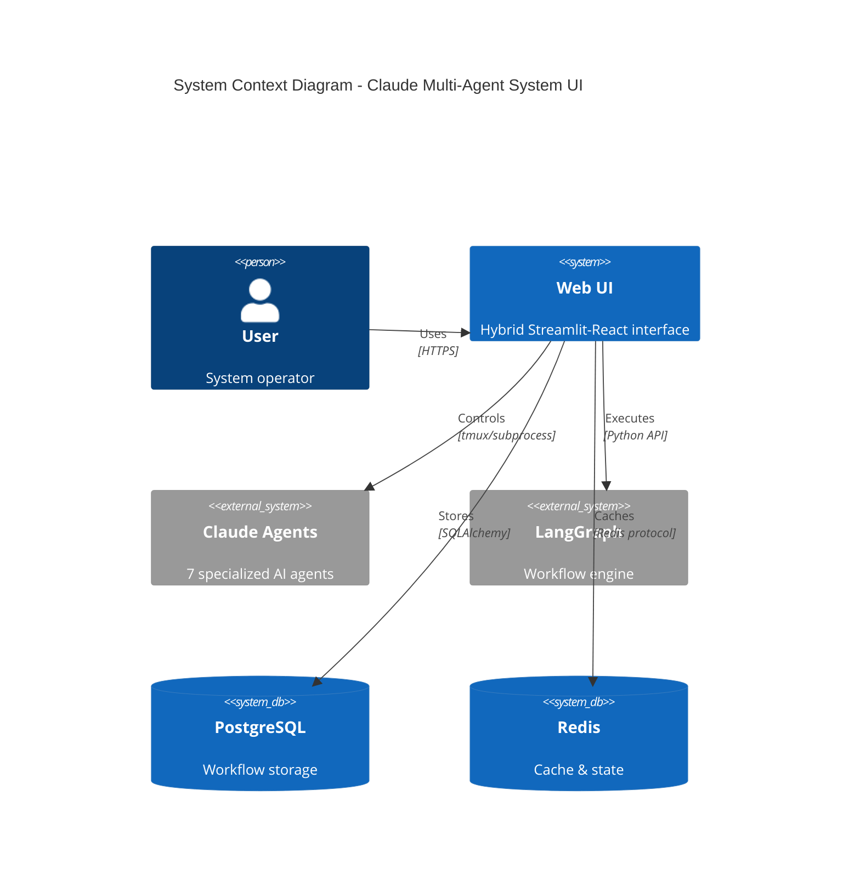

## Container Architecture

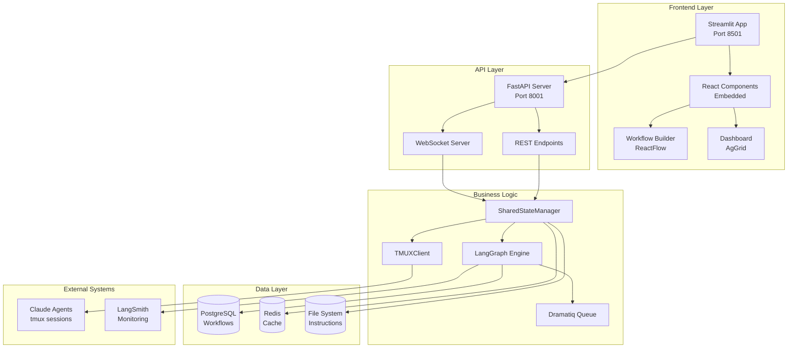

## Component Architecture

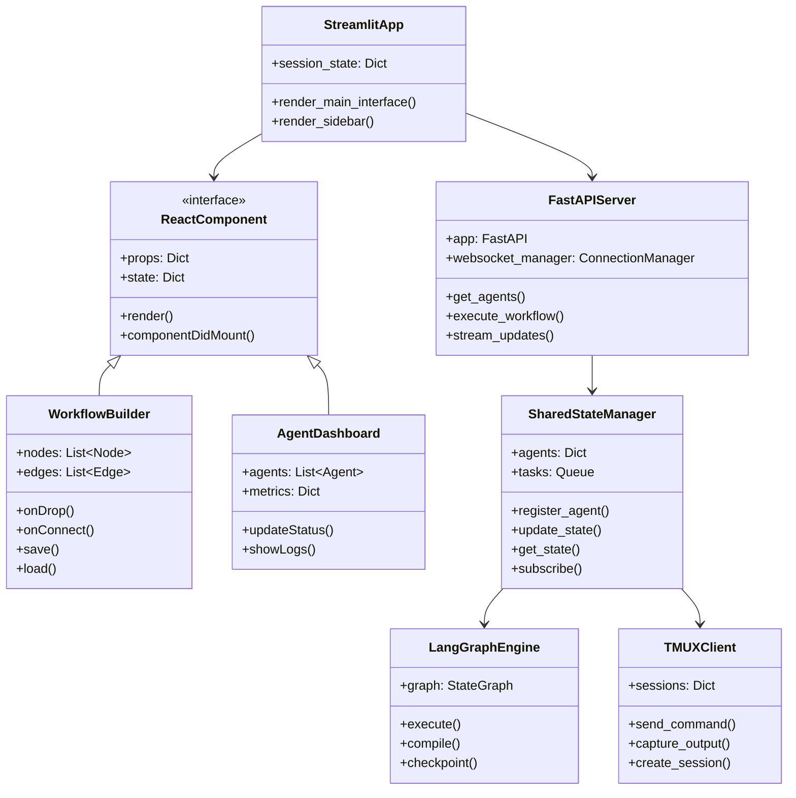

## Data Flow Architecture

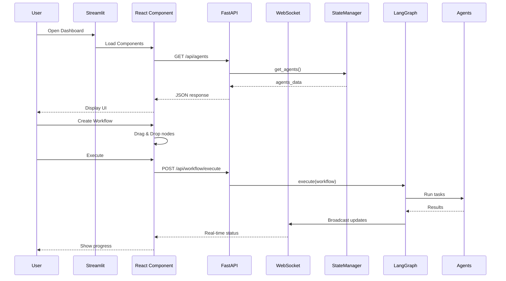

## Deployment Architecture

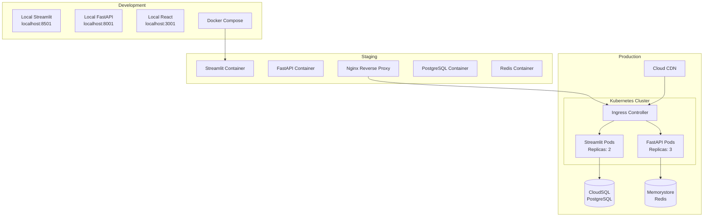

## Security Architecture

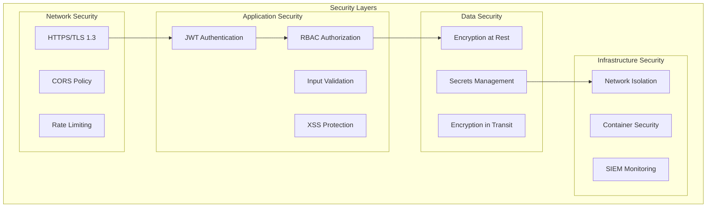

## API Specification

```yaml
openapi: 3.0.0
info:
  title: Claude Multi-Agent System API
  version: 1.0.0

paths:
  /api/agents:
    get:
      summary: Get all agents
      responses:
        200:
          content:
            application/json:
              schema:
                type: array
                items:
                  $ref: '#/components/schemas/Agent'

  /api/workflows:
    post:
      summary: Create workflow
      requestBody:
        content:
          application/json:
            schema:
              $ref: '#/components/schemas/Workflow'

  /api/workflows/{id}/execute:
    post:
      summary: Execute workflow
      parameters:
        - name: id
          in: path
          required: true
          schema:
            type: string

  /ws/updates:
    get:
      summary: WebSocket connection for real-time updates

components:
  schemas:
    Agent:
      type: object
      properties:
        id: string
        name: string
        status: string
        cpu: number
        memory: number

    Workflow:
      type: object
      properties:
        nodes: array
        edges: array
        metadata: object
```

## Database Schema

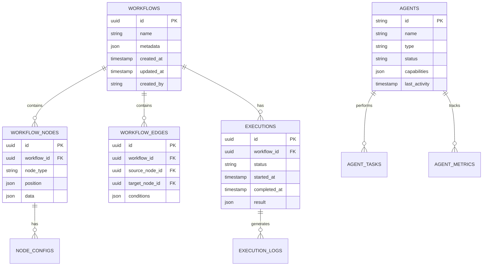

## Performance Architecture

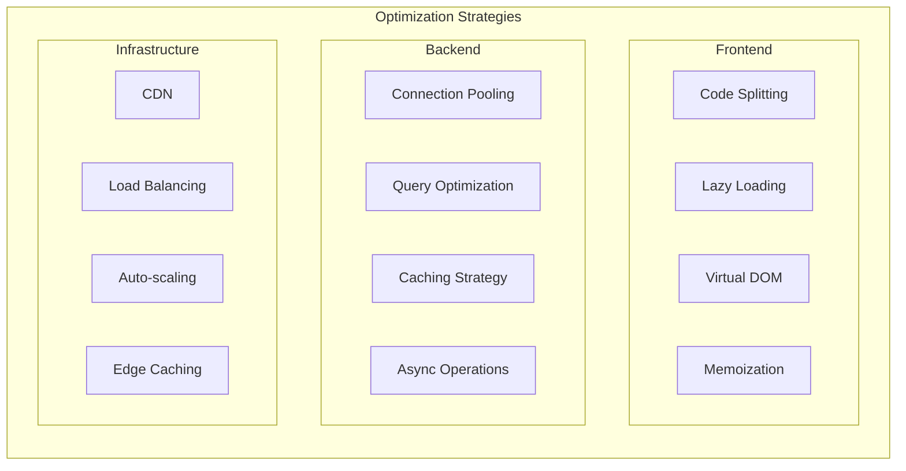

## Technology Stack

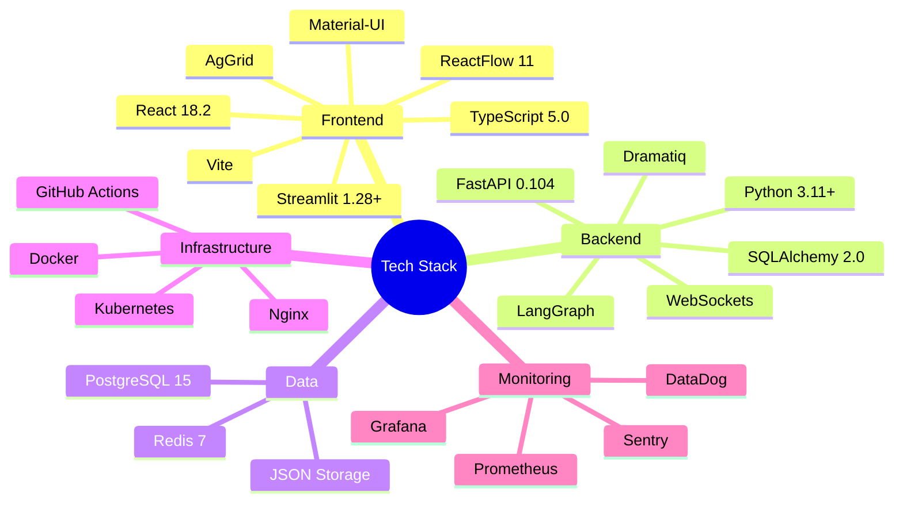

## Network Topology

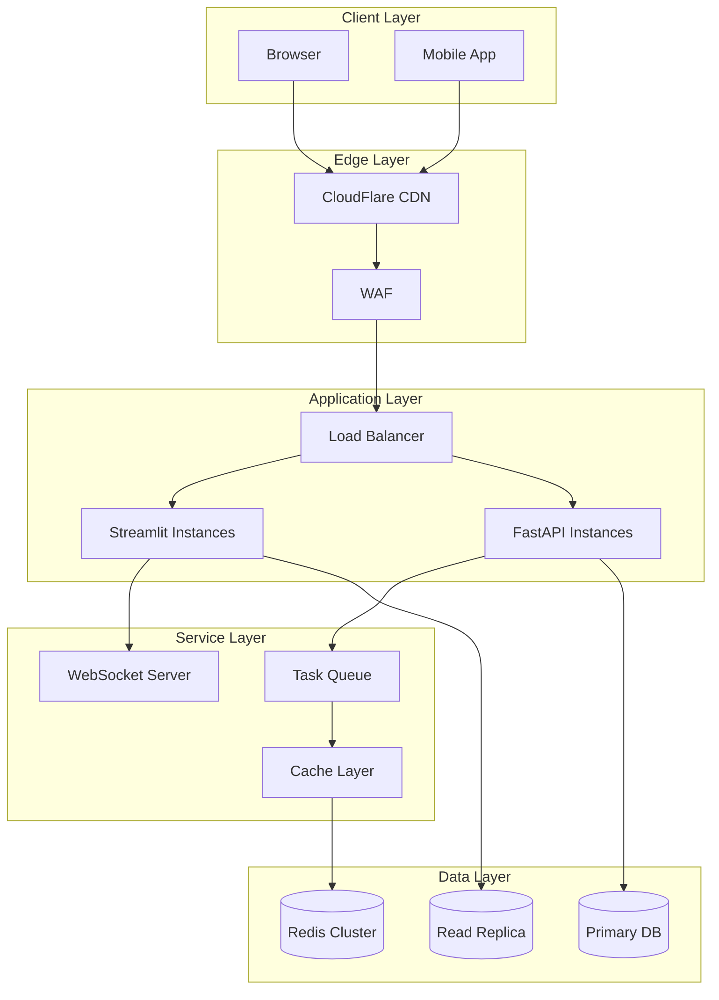

## Error Handling Strategy

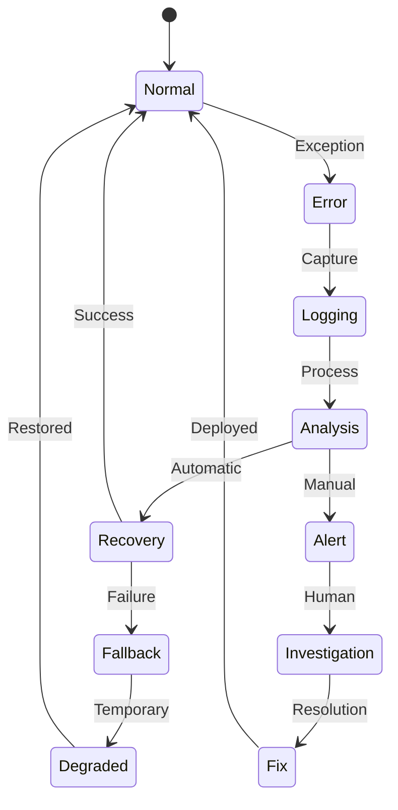

## Monitoring & Observability

```yaml
monitoring:
  metrics:
    application:
      - request_rate
      - response_time
      - error_rate
      - active_users

    infrastructure:
      - cpu_usage
      - memory_usage
      - disk_io
      - network_traffic

    business:
      - workflows_created
      - tasks_completed
      - agent_efficiency
      - user_satisfaction

  logging:
    levels:
      - ERROR: Sentry
      - WARNING: Application logs
      - INFO: Structured logs
      - DEBUG: Development only

  tracing:
    - Request flow
    - Database queries
    - External API calls
    - WebSocket messages

  alerting:
    channels:
      - email
      - slack
      - pagerduty

    rules:
      - error_rate > 1%
      - response_time > 2s
      - cpu_usage > 80%
      - memory_usage > 90%
```

## Scaling Strategy

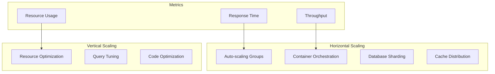

---

**Document Version**: 1.0
**Last Updated**: January 2024
**Status**: APPROVED
**Next Review**: Q2 2024
