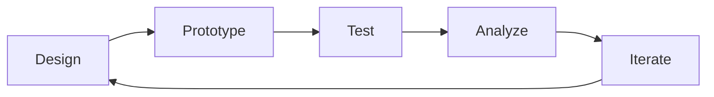

# UX Testing Guide

## 🎯 Testing Strategy Overview

### Objectives
- Validate workflow builder usability
- Ensure agent interaction patterns are intuitive
- Measure task completion rates
- Identify friction points in user journeys
- Gather feedback for iterative improvements

## 📋 Testing Methods

### 1. Usability Testing
**Purpose**: Evaluate ease of use and user satisfaction

#### Test Scenarios
```yaml
Scenario 1 - Create First Workflow:
  Task: Create a simple workflow with 3 agents
  Success Criteria:
    - Completion time < 5 minutes
    - No critical errors
    - User confidence rating > 7/10
  Metrics:
    - Time to complete
    - Number of errors
    - Help requests
    - User satisfaction score

Scenario 2 - Agent Command Execution:
  Task: Send command to backend-api agent
  Success Criteria:
    - Task completed without guidance
    - Response received < 3 seconds
    - Clear feedback provided
  Metrics:
    - Task success rate
    - Time to completion
    - Error recovery time

Scenario 3 - Monitor System Status:
  Task: Check health of all agents
  Success Criteria:
    - All status indicators understood
    - Can identify offline agents
    - Can interpret queue metrics
  Metrics:
    - Interpretation accuracy
    - Navigation efficiency
    - Information findability
```

#### Test Protocol
1. **Pre-test Survey**
   - Technical background
   - Familiarity with workflow tools
   - Expectations

2. **Think-Aloud Protocol**
   - Record screen and audio
   - Encourage verbalization
   - Note pain points

3. **Post-test Interview**
   - System Usability Scale (SUS)
   - Task difficulty ratings
   - Feature suggestions

### 2. A/B Testing
**Purpose**: Compare design alternatives

#### Test Variants
```typescript
// Variant A: Sidebar Navigation
interface LayoutA {
  navigation: 'sidebar';
  agentDisplay: 'cards';
  workflowOrientation: 'horizontal';
}

// Variant B: Top Navigation
interface LayoutB {
  navigation: 'topbar';
  agentDisplay: 'list';
  workflowOrientation: 'vertical';
}
```

#### Metrics to Track
- Click-through rates
- Task completion times
- Error rates
- User preference scores
- Engagement metrics

### 3. Accessibility Testing
**Purpose**: Ensure WCAG 2.1 AA compliance

#### Checklist
- [ ] **Keyboard Navigation**
  - All interactive elements reachable
  - Clear focus indicators
  - Logical tab order

- [ ] **Screen Reader Compatibility**
  - Proper ARIA labels
  - Semantic HTML structure
  - Meaningful alt text

- [ ] **Visual Accessibility**
  - Color contrast ratio ≥ 4.5:1
  - No color-only information
  - Resizable text up to 200%

- [ ] **Motion & Interaction**
  - Reduced motion options
  - No seizure triggers
  - Sufficient time limits

### 4. Performance Testing
**Purpose**: Validate UI responsiveness

#### Performance Criteria
```yaml
Interaction Metrics:
  Click Response: < 100ms
  Page Navigation: < 1s
  Workflow Save: < 500ms
  Agent Command: < 2s

Rendering Metrics:
  First Paint: < 1s
  First Contentful Paint: < 1.5s
  Time to Interactive: < 3s
  Largest Contentful Paint: < 2.5s
```

#### Testing Tools
- Lighthouse
- WebPageTest
- Chrome DevTools Performance
- React DevTools Profiler

## 🧪 Test Plan Execution

### Phase 1: Internal Testing (Week 1)
**Participants**: Development team (5-8 people)

#### Activities
- Heuristic evaluation
- Cognitive walkthrough
- Bug discovery
- Performance baseline

#### Deliverables
- Initial bug list
- Performance metrics
- Usability heuristic violations

### Phase 2: Alpha Testing (Week 2-3)
**Participants**: Internal stakeholders (10-15 people)

#### Activities
- Guided tasks
- Feature validation
- Workflow creation tests
- Feedback sessions

#### Deliverables
- Feature completion checklist
- Priority bug fixes
- UI adjustment recommendations

### Phase 3: Beta Testing (Week 4-5)
**Participants**: Selected users (20-30 people)

#### Activities
- Real-world usage scenarios
- Unguided exploration
- Comparative testing (old vs new)
- Survey collection

#### Deliverables
- User satisfaction scores
- Feature request list
- Final bug reports
- Performance benchmarks

## 📊 Success Metrics

### Quantitative Metrics
```yaml
Task Success Rates:
  Create Workflow: > 90%
  Execute Agent Command: > 95%
  Navigate Interface: > 95%
  Error Recovery: > 80%

Performance:
  System Usability Scale: > 80
  Net Promoter Score: > 50
  Task Completion Time: < baseline - 20%
  Error Rate: < 5%

Engagement:
  Daily Active Users: > 70%
  Feature Adoption: > 60%
  Session Duration: > 10 minutes
  Return Rate: > 80%
```

### Qualitative Metrics
- User sentiment analysis
- Feature satisfaction ratings
- Pain point identification
- Improvement suggestions

## 🔄 Iterative Testing Process

### Sprint Testing Cycle


### Weekly Schedule
- **Monday**: Plan tests, recruit participants
- **Tuesday-Wednesday**: Conduct tests
- **Thursday**: Analyze results
- **Friday**: Implement fixes, report findings

## 📝 Test Documentation

### Test Case Template
```markdown
## Test Case: [ID]
**Feature**: [Feature Name]
**Priority**: High/Medium/Low
**Type**: Functional/Usability/Performance

### Prerequisites
- [ ] User logged in
- [ ] Test data prepared
- [ ] Environment ready

### Steps
1. [Action 1]
2. [Action 2]
3. [Action 3]

### Expected Results
- [Result 1]
- [Result 2]

### Actual Results
- [Observed behavior]

### Status: Pass/Fail
### Notes: [Additional observations]
```

### Bug Report Template
```markdown
## Bug: [ID]
**Severity**: Critical/Major/Minor/Trivial
**Component**: [Affected Component]
**Browser/OS**: [Environment]

### Description
[Clear description of the issue]

### Steps to Reproduce
1. [Step 1]
2. [Step 2]

### Expected Behavior
[What should happen]

### Actual Behavior
[What actually happens]

### Screenshots/Videos
[Attachments]

### Workaround
[If any]
```

## 🎨 Prototype Testing

### Interactive Prototypes
1. **Figma Prototype**
   - Link: [To be added]
   - Password: [If protected]
   - Test flows: Workflow creation, agent management

2. **Storybook Components**
   ```bash
   npm run storybook
   ```
   - Component isolation testing
   - Visual regression testing
   - Interaction testing

3. **Local Development**
   ```bash
   npm run dev
   ```
   - Full application testing
   - Integration testing
   - Real data testing

## 🤝 User Feedback Channels

### Feedback Collection Methods
1. **In-app Feedback Widget**
   - Quick rating system
   - Screenshot capability
   - Context preservation

2. **User Surveys**
   - Post-task questionnaires
   - Weekly satisfaction surveys
   - Feature request forms

3. **Analytics Tracking**
   - Hotjar heatmaps
   - Google Analytics events
   - Custom telemetry

4. **Direct Communication**
   - User interviews
   - Focus groups
   - Support tickets analysis

## 📈 Reporting & Action Items

### Weekly Testing Report
```markdown
## Week [X] Testing Summary

### Tests Conducted
- [Number] usability tests
- [Number] bug reports filed
- [Number] performance tests

### Key Findings
1. [Finding 1]
2. [Finding 2]

### Metrics
- Average SUS Score: [X]
- Task Success Rate: [X]%
- Critical Bugs Found: [X]

### Action Items
- [ ] [Priority 1 fix]
- [ ] [Priority 2 fix]
- [ ] [Design adjustment]

### Next Week Focus
[Areas to test next]
```

## 🚀 Testing Tools Setup

### Required Tools
```bash
# Install testing dependencies
npm install -D @testing-library/react @testing-library/user-event
npm install -D @axe-core/react cypress playwright
npm install -D @storybook/react @storybook/addon-a11y

# Performance monitoring
npm install web-vitals

# Analytics
npm install react-ga4 @hotjar/browser
```

### Configuration Files
```javascript
// cypress.config.js
export default {
  e2e: {
    baseUrl: 'http://localhost:3000',
    video: true,
    screenshotOnRunFailure: true
  }
}

// playwright.config.js
export default {
  use: {
    baseURL: 'http://localhost:3000',
    screenshot: 'only-on-failure',
    video: 'retain-on-failure'
  }
}
```

## ✅ Testing Checklist

### Pre-Launch Checklist
- [ ] All critical user paths tested
- [ ] Cross-browser compatibility verified
- [ ] Mobile responsiveness confirmed
- [ ] Accessibility audit passed
- [ ] Performance benchmarks met
- [ ] Security testing completed
- [ ] Load testing performed
- [ ] Documentation updated
- [ ] Training materials prepared
- [ ] Rollback plan tested

---

**Document Version**: 1.0.0
**Last Updated**: September 2024
**Owner**: UX Team
**Next Review**: October 2024