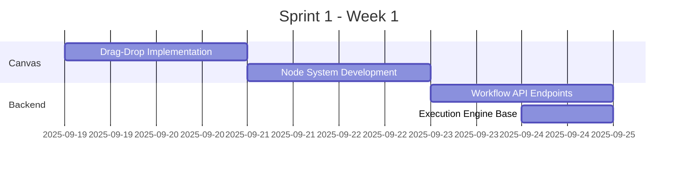
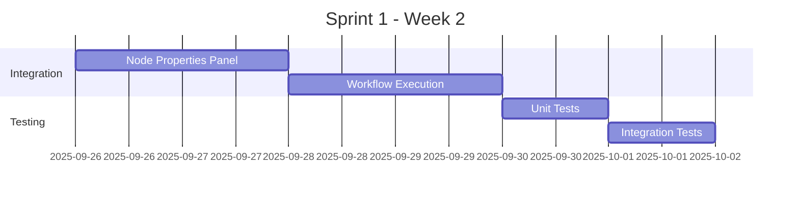

# 🗺️ V2 DEVELOPMENT ROADMAP - Claude Multi-Agent System

**Versione**: 2.0.0
**Data**: 18 Settembre 2025
**Status**: 🚧 **In Development - 65% Complete**

---

## 📊 EXECUTIVE SUMMARY

La Dashboard V2 ha raggiunto il **65% di completamento** con successi significativi nella migrazione da Streamlit a React. Tuttavia, funzionalità critiche come il **Workflow Builder visuale** e **real-time updates** rimangono da implementare.

### 🎯 Obiettivi Principali
1. **Completare Workflow Builder** (P0 - 2 settimane)
2. **Implementare WebSocket real-time** (P1 - 1 settimana)
3. **Integrare dati reali** (P1 - 1 settimana)
4. **Aggiungere autenticazione base** (P2 - 1 settimana)

---

## 🏁 ROADMAP SPRINTS

### 🔴 SPRINT 1: WORKFLOW BUILDER (19 Set - 2 Ott)

#### Week 1 (19-25 Set)


**Deliverables Week 1:**
- [ ] Canvas drag-drop funzionante
- [ ] 5+ node types implementati
- [ ] API CRUD per workflows
- [ ] Save/Load workflows

#### Week 2 (26 Set - 2 Ott)


**Deliverables Week 2:**
- [ ] Properties panel dinamico
- [ ] Workflow execution completa
- [ ] Error handling robusto
- [ ] Test coverage >40%

**Success Metrics Sprint 1:**
- ✅ Utente può creare workflow con 10+ nodes
- ✅ Workflow salvati e ricaricabili
- ✅ Esecuzione con feedback visuale
- ✅ Zero bug critici

---

### ⚡ SPRINT 2: REAL-TIME INTEGRATION (3-16 Ott)

#### Week 3 (3-9 Ott)
```yaml
Focus: WebSocket Implementation
Tasks:
  - Socket.IO server setup
  - Client WebSocket service
  - Event system design
  - Agent status streaming
  - Log streaming from TMUX
```

#### Week 4 (10-16 Ott)
```yaml
Focus: Data Integration
Tasks:
  - Redis queue real stats
  - CPU/Memory metrics collection
  - Inbox UI integration complete
  - Performance charts real data
  - Remove ALL mock data
```

**Deliverables Sprint 2:**
- [ ] WebSocket bi-directional communication
- [ ] Real-time latency <100ms
- [ ] All mock data replaced
- [ ] Live metrics dashboard

---

### 🔐 SPRINT 3: SECURITY & PRODUCTION (17-30 Ott)

#### Week 5 (17-23 Ott)
```typescript
// Authentication Implementation
- JWT token system
- Login/Register flow
- Protected routes
- Session management
- Role-based access control basics
```

#### Week 6 (24-30 Ott)
```sql
-- Database & Persistence
- PostgreSQL migration
- Alembic migrations setup
- Data model optimization
- Backup/restore procedures
- Transaction management
```

**Deliverables Sprint 3:**
- [ ] Authentication fully functional
- [ ] PostgreSQL as primary DB
- [ ] Data persistence complete
- [ ] Security audit passed

---

### 🚀 SPRINT 4: POLISH & DEPLOYMENT (31 Ott - 13 Nov)

#### Week 7 (31 Ott - 6 Nov)
**Testing & Optimization**
- Unit tests (target: 60% coverage)
- E2E tests for critical paths
- Performance optimization
- Bundle size reduction
- Memory leak fixes

#### Week 8 (7-13 Nov)
**Deployment & Documentation**
- Docker containerization
- CI/CD pipeline setup
- Production deployment guide
- User documentation
- Video tutorials

**Deliverables Sprint 4:**
- [ ] Production-ready build
- [ ] Complete documentation
- [ ] Deployment automated
- [ ] Performance targets met

---

## 📈 PROGRESS TRACKING

### Current Status (18 Set)
```
Overall Progress:     ████████████░░░░░░░░  65%
Workflow Builder:     ████░░░░░░░░░░░░░░░░  20%
Real-time Updates:    ██████░░░░░░░░░░░░░░  30%
Data Integration:     ████████████░░░░░░░░  60%
Authentication:       ░░░░░░░░░░░░░░░░░░░░   0%
Testing:              ██░░░░░░░░░░░░░░░░░░  10%
Documentation:        ██████░░░░░░░░░░░░░░  30%
```

### Sprint Targets
```
Sprint 1 Complete:    ████████████████░░░░  80%
Sprint 2 Complete:    ██████████████████░░  90%
Sprint 3 Complete:    ███████████████████░  95%
Sprint 4 Complete:    ████████████████████ 100%
```

---

## 🎯 MILESTONE DEFINITIONS

### M1: Workflow Builder MVP (2 Ott)
- ✓ Visual workflow creation
- ✓ Node library functional
- ✓ Save/Load workflows
- ✓ Basic execution

### M2: Real-time System (16 Ott)
- ✓ WebSocket operational
- ✓ Live data streaming
- ✓ No mock data
- ✓ <100ms latency

### M3: Production Ready (30 Ott)
- ✓ Authentication working
- ✓ PostgreSQL integrated
- ✓ Security hardened
- ✓ Error recovery

### M4: Launch Ready (13 Nov)
- ✓ All tests passing
- ✓ Documentation complete
- ✓ Deployment automated
- ✓ User training ready

---

## 📋 FEATURE PRIORITY MATRIX

### P0 - Critical (Must Have)
| Feature | Sprint | Status | Owner |
|---------|--------|--------|-------|
| Workflow Canvas | 1 | 🔄 In Progress | - |
| Node System | 1 | 📅 Planned | - |
| Execution Engine | 1 | 📅 Planned | - |
| WebSocket Core | 2 | 📅 Planned | - |

### P1 - High (Should Have)
| Feature | Sprint | Status | Owner |
|---------|--------|--------|-------|
| Real-time Updates | 2 | 📅 Planned | - |
| Data Integration | 2 | 📅 Planned | - |
| Authentication | 3 | 📅 Planned | - |
| PostgreSQL | 3 | 📅 Planned | - |

### P2 - Medium (Nice to Have)
| Feature | Sprint | Status | Owner |
|---------|--------|--------|-------|
| Advanced RBAC | 3 | 📅 Planned | - |
| Performance Monitoring | 4 | 📅 Planned | - |
| Comprehensive Tests | 4 | 📅 Planned | - |
| Video Tutorials | 4 | 📅 Planned | - |

### P3 - Low (Future)
| Feature | Sprint | Status | Owner |
|---------|--------|--------|-------|
| Multi-tenancy | Future | 💡 Idea | - |
| i18n Support | Future | 💡 Idea | - |
| Mobile App | Future | 💡 Idea | - |
| AI Insights | Future | 💡 Idea | - |

---

## 🛠️ TECHNICAL IMPLEMENTATION PLAN

### Sprint 1 Technical Tasks
```typescript
// frontend/src/components/workflow/
├── WorkflowCanvas.tsx       // Main canvas component
├── NodePalette.tsx          // Draggable node library
├── NodeTypes/
│   ├── AgentNode.tsx
│   ├── TriggerNode.tsx
│   ├── ActionNode.tsx
│   └── LogicNode.tsx
├── EdgeTypes/
│   ├── DefaultEdge.tsx
│   └── ConditionalEdge.tsx
├── PropertiesPanel.tsx      // Dynamic node config
└── ExecutionOverlay.tsx     // Execution feedback

// backend/api/
├── workflows/
│   ├── router.py           // CRUD endpoints
│   ├── models.py           // SQLAlchemy models
│   ├── schemas.py          // Pydantic schemas
│   └── service.py          // Business logic
└── execution/
    ├── engine.py           // Workflow executor
    ├── scheduler.py        // Task scheduling
    └── monitor.py          // Progress tracking
```

### Sprint 2 Technical Tasks
```python
# WebSocket Implementation
class WorkflowHub:
    async def connect(websocket: WebSocket):
        # Client connection handling

    async def broadcast_update(workflow_id: str, data: dict):
        # Real-time updates

    async def stream_logs(agent_id: str):
        # Log streaming from TMUX

# Metrics Collection
class MetricsCollector:
    def collect_system_metrics():
        # CPU, Memory, Disk

    def collect_agent_metrics(agent_id: str):
        # Per-agent metrics

    def store_timeseries(metrics: dict):
        # Store in TimescaleDB/SQLite
```

### Sprint 3 Technical Tasks
```python
# Authentication System
from fastapi_users import FastAPIUsers
from fastapi_users.authentication import JWTAuthentication

# Database Migration
"""
alembic revision --autogenerate -m "Initial migration"
alembic upgrade head
"""

# PostgreSQL Models
class Workflow(Base):
    __tablename__ = "workflows"
    id = Column(UUID, primary_key=True)
    name = Column(String, nullable=False)
    definition = Column(JSONB, nullable=False)
    created_by = Column(UUID, ForeignKey("users.id"))
    created_at = Column(DateTime, default=datetime.utcnow)
```

---

## 📊 RESOURCE REQUIREMENTS

### Team Allocation
| Role | Sprint 1 | Sprint 2 | Sprint 3 | Sprint 4 |
|------|----------|----------|----------|----------|
| Frontend Dev | 100% | 60% | 40% | 60% |
| Backend Dev | 60% | 100% | 80% | 40% |
| DevOps | 20% | 20% | 60% | 100% |
| QA/Testing | 20% | 40% | 60% | 80% |

### Infrastructure Needs
- **Development**: Local Docker environment
- **Staging**: AWS EC2 t3.medium or equivalent
- **Production**: AWS EC2 t3.large + RDS PostgreSQL
- **Monitoring**: Prometheus + Grafana
- **CI/CD**: GitHub Actions or GitLab CI

---

## 🚦 RISK MITIGATION

### Technical Risks
| Risk | Impact | Probability | Mitigation |
|------|---------|------------|------------|
| Workflow complexity | High | High | Incremental features, MVP first |
| WebSocket scaling | High | Medium | Load testing, connection pooling |
| Data migration | Medium | Medium | Backup strategy, rollback plan |
| Performance issues | Medium | Low | Profiling, optimization sprints |

### Project Risks
| Risk | Impact | Probability | Mitigation |
|------|---------|------------|------------|
| Timeline slip | High | Medium | Buffer time, prioritization |
| Scope creep | Medium | High | Strict sprint planning |
| Technical debt | Low | High | Refactoring sessions |
| Team availability | High | Low | Knowledge sharing, documentation |

---

## 📈 SUCCESS METRICS

### Technical KPIs
- **Page Load Time**: <1.5s (current: 2.5s)
- **WebSocket Latency**: <100ms (current: 15s polling)
- **API Response Time**: <200ms p95
- **Test Coverage**: >60% (current: 10%)
- **Bundle Size**: <500KB gzipped
- **Memory Usage**: <200MB per client

### Business KPIs
- **Workflow Creation Time**: -70% vs manual
- **Agent Utilization**: >80%
- **System Uptime**: 99.9%
- **User Satisfaction**: >4.5/5
- **Time to Deploy**: <30 minutes
- **Bug Count**: <10 minor, 0 critical

---

## 📚 DOCUMENTATION DELIVERABLES

### Sprint 1 Docs
- [ ] Workflow Builder User Guide
- [ ] Node Types Reference
- [ ] API Documentation (OpenAPI)

### Sprint 2 Docs
- [ ] WebSocket Events Reference
- [ ] Real-time Integration Guide
- [ ] Metrics API Documentation

### Sprint 3 Docs
- [ ] Authentication Flow Guide
- [ ] Database Schema Documentation
- [ ] Security Best Practices

### Sprint 4 Docs
- [ ] Deployment Guide
- [ ] Operations Manual
- [ ] Video Tutorials (5x)
- [ ] Troubleshooting Guide

---

## 🎉 CELEBRATION MILESTONES

### 🏆 Sprint Completion Rewards
- **Sprint 1**: Workflow Builder Demo Day
- **Sprint 2**: Real-time Dashboard Party
- **Sprint 3**: Security Badge Ceremony
- **Sprint 4**: Launch Celebration

---

## 📅 KEY DATES

| Date | Event | Description |
|------|-------|-------------|
| 19 Set | Sprint 1 Start | Workflow Builder development begins |
| 2 Ott | M1 Deadline | Workflow Builder MVP complete |
| 3 Ott | Sprint 2 Start | Real-time integration begins |
| 16 Ott | M2 Deadline | Real-time system operational |
| 17 Ott | Sprint 3 Start | Security & production prep |
| 30 Ott | M3 Deadline | Production ready |
| 31 Ott | Sprint 4 Start | Polish & deployment |
| 13 Nov | 🚀 **LAUNCH** | V2 goes live! |

---

## ✅ DEFINITION OF DONE

### Feature Level
- [ ] Code complete and reviewed
- [ ] Unit tests written and passing
- [ ] Integration tests passing
- [ ] Documentation updated
- [ ] No critical bugs
- [ ] Performance benchmarks met

### Sprint Level
- [ ] All committed stories complete
- [ ] Sprint demo successful
- [ ] Retrospective completed
- [ ] Documentation updated
- [ ] Next sprint planned

### Release Level
- [ ] All features complete
- [ ] Test coverage >60%
- [ ] Performance targets met
- [ ] Security audit passed
- [ ] Documentation complete
- [ ] Deployment successful

---

## 📞 CONTACTS & RESOURCES

### Resources
- **Repository**: `/claude-multiagent-system`
- **Dashboard V2**: `/claude-ui`
- **Documentation**: `/ui-ux-design`
- **API**: `http://localhost:8000`
- **Frontend**: `http://localhost:5173`

### Communication
- **Daily Standup**: 09:00
- **Sprint Planning**: Monday AM
- **Sprint Review**: Friday PM
- **Retrospective**: Friday PM

---

**Document Version**: 1.0.0
**Last Updated**: 18 September 2025
**Next Review**: 2 October 2025 (End of Sprint 1)
**Status**: 🟢 **Active Development**

---

*"From 65% to 100% - Making V2 Production Ready!"*